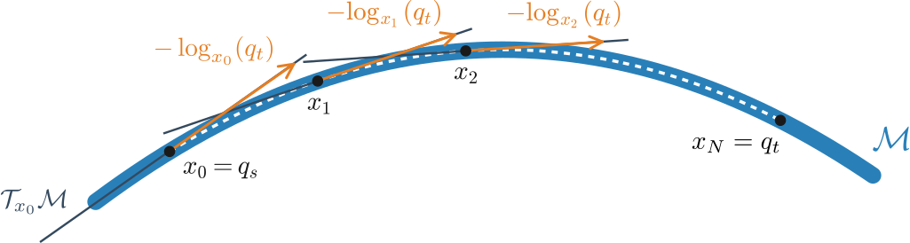
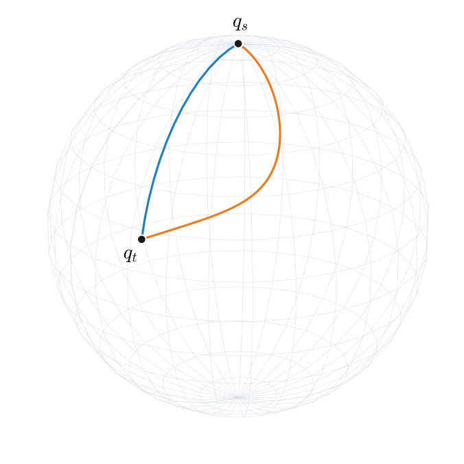

Discrete Geodesic Interpolation
===============================

``discrete_geodesic`` is the core interpolation function in geodex.
Given a manifold :math:`\mathcal{M}`, a start point :math:`q_s`, and a target :math:`q_t`, it returns a sequence of points on :math:`\mathcal{M}` approximating a length-minimizing geodesic between them.
The same subroutine drives midpoint distance estimation, edge interpolation in motion planners, and any code path that needs a geodesic on a manifold whose true logarithm is unavailable, expensive, or inconsistent with the metric in use. 
This page explains how the algorithm works, the design decisions behind it, how to tune its parameters, and how to call it from C++ and Python.

Problem statement
-----------------

.. raw:: html

   

We minimize the squared Riemannian distance to the target,

.. math::

   \varphi(x) \;=\; \tfrac{1}{2}\, d_g^2(x,\, q_t),

starting from :math:`x_0 = q_s` and taking Riemannian gradient steps. Every successful
iterate is recorded as a waypoint, so on convergence the returned path traces a
discrete approximation of the geodesic from :math:`q_s` to :math:`q_t`.

At each iterate :math:`x_k`, the descent direction lives in the tangent space
:math:`\mathcal{T}_{x_k}\mathcal{M}` and points along :math:`-\log_{x_k}(q_t)`. The
next iterate :math:`x_{k+1}` is obtained by retracting back to :math:`\mathcal{M}`
along that direction, capped at the current step length.

How the algorithm works
-----------------------

Each iteration computes a descent direction in :math:`\mathcal{T}_x\mathcal{M}`,
caps its Riemannian length at the current step budget, and moves to the next iterate
through the manifold's retraction.

Fast path
^^^^^^^^^

When the manifold's ``log`` is the Riemannian logarithm of the metric in use, the
gradient of :math:`\varphi` has a closed form:

.. math::

   \nabla_g \!\left[ \tfrac{1}{2}\, d_g^2(\cdot,\, q_t) \right]\!(x) \;=\; -\log_x(q_t).

The algorithm uses this direction directly, normalizes it, scales by the current step
cap, and retracts. This is by far the cheapest path: one ``log``, one ``retract``,
and a progress check per iteration.

.. note::

   The identity :math:`\nabla_g \tfrac{1}{2} d_g^2 = -\log` is standard; see Sakai's
   *Riemannian Geometry* (§IV.5) or do Carmo's *Riemannian Geometry* (Ch. 13, Prop.
   3.6) for the derivation.

Finite-difference fallback
^^^^^^^^^^^^^^^^^^^^^^^^^^

When ``log`` is not the Riemannian logarithm of the chosen metric (anything built on
``ConstantSPDMetric``, ``KineticEnergyMetric``, ``JacobiMetric``, ``PullbackMetric``,
or any callable metric), or when the closed-form direction fails the progress check,
the iteration falls back to a finite-difference natural gradient computed from the
metric's ``inner`` product:

1. Build an orthonormal tangent basis :math:`\{e_i\}` at the current point. If the
   manifold exposes a ``project`` method, ambient seed vectors are projected to
   :math:`\mathcal{T}_x\mathcal{M}` before Gram-Schmidt orthonormalization.
2. Assemble the metric tensor in this basis,
   :math:`G_{ij} = g_x(e_i, e_j)`. When the metric provides a batched
   ``inner_matrix``, the whole Gram matrix is filled in one call.
3. Estimate the coordinate-space gradient :math:`g_i = \partial_{e_i} \varphi(x)` by
   central finite differences along each basis direction.
4. Solve :math:`G\,\alpha = -g` via Cholesky. The natural gradient in
   ambient coordinates is :math:`v = \sum_i \alpha_i\, e_i`.

The fallback engages on a per-step basis, so a single walk can mix fast-path and
finite-difference iterations as the geometry demands.

Adaptive step control and termination
-------------------------------------

A retraction is only an approximation of the exponential map, and on a curved
manifold an aggressive step can either overshoot the target or land somewhere whose
realized length differs noticeably from the requested length. After each candidate
step, the algorithm measures :math:`\|\log_x(x_{\text{next}})\|_g` and compares it to
the requested step length. If the ratio exceeds ``distortion_ratio``, or the
candidate fails to decrease the squared distance, the step cap is halved and the
iteration retries. After a successful step the cap regrows by ``growth_factor`` until
it reaches ``step_size`` again. This trust-region behavior keeps the walk stable
under heavy curvature without forcing the user to pick a tiny global step size.

The loop ends with one of the following statuses:

``Converged``
   The Riemannian distance to the target dropped below ``convergence_tol`` or below
   ``convergence_rel * initial_distance``. The returned path ends at, or very close
   to, ``target``.

``MaxStepsReached``
   The iteration budget was exhausted. The path is still a valid descent sequence,
   but it has not reached the target. Inspect ``final_distance`` to decide whether
   it is good enough.

``GradientVanished``
   The Riemannian gradient norm collapsed at a non-target point. This is rare in
   practice and usually indicates that the metric or finite-difference step is
   misconfigured.

``CutLocus``
   ``log`` returned (numerically) zero while the ambient gap to the target is
   nonzero. The classic example is exact antipodal points on the sphere, where the
   logarithm is multivalued. This is the correct response, not a bug.

``StepShrunkToZero``
   The distortion guard halved the step cap below ``min_step_size``. This usually
   means the retraction is incompatible with the metric in this neighborhood.

``DegenerateInput``
   ``start`` and ``target`` were the same point (within tolerance) at entry.

Tuning the parameters
---------------------

Every parameter lives on ``InterpolationSettings``. Defaults are sensible for moderate
problems on the unit sphere; you should expect to revisit ``step_size`` and
``max_steps`` for tighter workspaces or heavier metrics.

.. list-table::
   :header-rows: 1
   :widths: 30 15 58

   * - Parameter
     - Default
     - Effect
   * - ``step_size``
     - 0.5
     - Maximum Riemannian step per iteration. Also the effective path resolution:
       consecutive returned points are at most ``step_size`` apart in the metric.
       Smaller values give a denser path and a smoother walk under aggressive
       curvature, at the cost of more iterations.
   * - ``convergence_tol``
     - 1e-4
     - Absolute stop threshold on the Riemannian distance to the target.
   * - ``convergence_rel``
     - 1e-3
     - Relative stop threshold; the walk also stops when the distance drops below
       ``convergence_rel * initial_distance``. Useful when the working scale of the
       problem is much larger or smaller than the absolute tolerance.
   * - ``max_steps``
     - 100
     - Successful gradient steps before giving up. Distortion retries do not count.
   * - ``fd_epsilon``
     - 0.0
     - Central finite-difference step. Zero auto-selects
       :math:`\max(10^{-8},\, 10^{-5} \cdot \max(1, d_0))` from the initial distance,
       which is the right choice in nearly all cases.
   * - ``distortion_ratio``
     - 1.5
     - How much the realized step length is allowed to exceed the requested length
       before the retraction is considered to have overshot. Lower this for
       retractions that drift visibly from the exponential map.
   * - ``growth_factor``
     - 1.5
     - How quickly the step cap regrows after a successful iteration. Set to ``1.0``
       to disable growth and keep the cap fixed at whatever the distortion guard
       last permitted.
   * - ``min_step_size``
     - 1e-12
     - Floor on the step cap. The walk fails with ``StepShrunkToZero`` once it is
       crossed.
   * - ``gradient_eps``
     - 1e-12
     - Riemannian-norm threshold below which the gradient is considered vanished.
   * - ``cut_locus_eps``
     - 1e-10
     - Threshold on :math:`\|\log_x(q_t)\|_g` that, combined with a nonzero ambient
       gap, flags a cut-locus situation.

In day-to-day use, the three parameters worth reaching for first are ``step_size``,
``convergence_tol``, and ``distortion_ratio``. ``step_size`` has the most impact:
halving it doubles both the path resolution and the iteration count, but it also
makes the walk far more tolerant of curvature and metric anisotropy.
``convergence_tol`` and ``convergence_rel`` together set how tightly the final
iterate must approach the target; loosen them when the downstream consumer only
needs a coarse path. ``distortion_ratio`` is the safety valve for retractions that
are not isometries, such as ``SphereProjectionRetraction`` under an anisotropic
metric or ``SE2EulerRetraction`` away from :math:`\theta = 0`.

For hot loops, pass an ``InterpolationWorkspace`` to reuse the basis matrix, Gram
matrix, and gradient buffers across calls. The workspace is resized once on first use
and then avoids all per-iteration heap allocations.

Worked example: S² with an anisotropic metric
---------------------------------------------

The example below runs ``discrete_geodesic`` twice on the unit 2-sphere between the
north pole and a target in the upper hemisphere. The first call uses the default
round metric, so the fast path executes and the walk traces the great circle exactly.
The second call swaps in a constant SPD metric :math:`A = \mathrm{diag}(25, 1, 1)`
that heavily penalizes motion in the :math:`x` direction; the finite-difference
fallback runs, and the resulting path bends visibly away from the great circle in
order to spend less length along the penalized axis.

.. tabs::

   .. code-tab:: c++

      #include <Eigen/Core>
      #include <geodex/geodex.hpp>

      using namespace geodex;

      int main() {
        const Eigen::Vector3d start(0.0, 0.0, 1.0);
        const Eigen::Vector3d target(
            std::sin(1.3) * std::cos(0.5),
            std::sin(1.3) * std::sin(0.5),
            std::cos(1.3));

        InterpolationSettings s;
        s.step_size = 0.05;
        s.max_steps = 500;

        // 1. Round sphere — fast path, traces the great circle.
        Sphere<> round_sphere;
        auto great = discrete_geodesic(round_sphere, start, target, s);

        // 2. Anisotropic constant-SPD metric — finite-difference fallback.
        Eigen::Matrix3d A = Eigen::Matrix3d::Identity();
        A(0, 0) = 25.0;
        Sphere<2, ConstantSPDMetric<3>> stretched{ConstantSPDMetric<3>{A}};
        auto bent = discrete_geodesic(stretched, start, target, s);

        // great.path and bent.path are std::vector<Eigen::Vector3d> waypoints.
      }

   .. code-tab:: py

      import numpy as np
      import geodex

      start  = np.array([0.0, 0.0, 1.0])
      target = np.array([
          np.sin(1.3) * np.cos(0.5),
          np.sin(1.3) * np.sin(0.5),
          np.cos(1.3),
      ])

      settings = geodex.InterpolationSettings(step_size=0.05, max_steps=500)

      # 1. Round sphere — fast path, traces the great circle.
      round_sphere = geodex.Sphere()
      great = geodex.discrete_geodesic(round_sphere, start, target, settings)

      # 2. Anisotropic constant-SPD metric, attached via ConfigurationSpace.
      A = np.diag([25.0, 1.0, 1.0])
      stretched = geodex.ConfigurationSpace(round_sphere, geodex.ConstantSPDMetric(A))
      bent = geodex.discrete_geodesic(stretched, start, target, settings)

The two paths visualised on :math:`\mathbb{S}^2`:

The blue curve is the great circle path returned by the fast path under the
round metric. The orange curve is the natural-gradient walk under
:math:`A = \mathrm{diag}(25, 1, 1)`; both endpoints are identical, but the second
path leaves the great circle to favour motion along :math:`y` and :math:`z`, where
the metric is cheaper.

Common pitfalls
---------------

.. warning::

   - Anisotropic metrics combined with first-order retractions such as
     ``SphereProjectionRetraction`` rely on the distortion guard to stay stable.
     Do not raise ``distortion_ratio`` past 2 unless you have measured what the
     retraction actually does in your neighborhood.
   - Near-antipodal inputs on the sphere may legitimately terminate with
     ``CutLocus``. The logarithm is multivalued there, and no descent direction is
     well defined. Pre-split the problem if you need to traverse the cut.
   - The default ``step_size = 0.5`` is large for tight workspaces or heavy metrics.
     If you see ``MaxStepsReached`` or many distortion halvings in
     ``distortion_halvings``, halve ``step_size`` first and re-run.
   - Always check ``result.status`` before consuming ``result.path``. A walk that
     stopped on ``MaxStepsReached`` still returns a valid descent sequence, but its
     last point is not the target.

See also
--------

- :doc:`architecture` for the policy types that ``discrete_geodesic`` consumes.
- :doc:`/tutorials/geodex-basics` for end-to-end use of the library.
- :doc:`/api/index` for the full API reference of ``discrete_geodesic``,
  ``InterpolationSettings``, ``InterpolationResult``, and
  ``InterpolationWorkspace``.

References
----------

Full details are in our WAFR 2026 paper :cite:`kyaw2026geometry`.
This page is a usage-oriented summary of the same algorithm.

.. bibliography::
   :filter: docname in docnames
