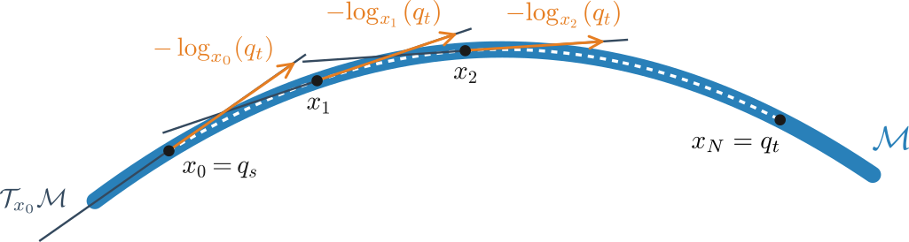

Discrete Geodesic Interpolation
===============================

``discrete_geodesic`` approximates the shortest path from a start :math:`q_s` to a target
:math:`q_t` on a manifold :math:`\mathcal{M}` as a sequence of points. It works under any
metric, including the kinetic-energy and clearance metrics, whose geodesics do not have a
closed form. The planner uses it for its edges when ``interp`` is ``"riemannian_geodesic"``,
and under ``"auto"`` when the manifold's ``geodesic`` does not follow the metric (see
:doc:`planning`). This page describes the algorithm and its settings, and runs it on the
sphere under two metrics.

Problem statement
-----------------

         directions.

``discrete_geodesic`` minimizes the squared Riemannian distance to the target,

.. math::

   \varphi(x) \;=\; \tfrac{1}{2}\, d_g^2(x,\, q_t),

with Riemannian gradient steps from :math:`x_0 = q_s`. Every accepted step adds a point to
the path, and the points of a converged walk approximate the geodesic from :math:`q_s` to
:math:`q_t`.

How the algorithm works
-----------------------

Each iteration computes a descent direction in :math:`\mathcal{T}_x\mathcal{M}`, scales it
to the current step cap, and moves along it with the manifold's retraction.

Fast path
^^^^^^^^^

When the manifold's ``log`` is the Riemannian logarithm of the metric in use, the gradient of
:math:`\varphi` has a closed form :footcite:`Lee2018`,

.. math::

   \nabla_g \!\left[ \tfrac{1}{2}\, d_g^2(\cdot,\, q_t) \right]\!(x) \;=\; -\log_x(q_t).

The fast path steps along :math:`\log_x(q_t)`, scaled to the step cap. Each step costs one
``log``, one ``retract`` and a progress check.

``is_riemannian_log(m)`` returns whether the fast path applies. It reads the compile-time
trait ``M::has_riemannian_log`` or the run-time hook ``m.has_riemannian_log_runtime()``. For
the built-in manifolds, it returns ``true`` for

- ``Euclidean`` and ``Torus`` with the identity metric,
- ``Sphere`` with the round metric and the exponential map,
- ``SO2`` with unit weight and ``SO3`` with equal weights,
- ``SE2`` with the Euler retraction and equal translational weights,
- a ``Product`` whose every factor returns ``true``.

It returns ``false`` for ``SE2`` and ``SE3`` with their group exponentials and for every
``ConfigurationSpace``. These take the finite-difference path below.

``force_log_direction = true`` steps along :math:`\log_x(q_t)` under every metric and takes a
finite-difference step only when a log step fails its checks. The metric still sets the step
lengths and the stopping test, and the path follows the geodesic of the retraction instead of
the geodesic of the metric.

Finite-difference path
^^^^^^^^^^^^^^^^^^^^^^

When ``log`` is not the Riemannian logarithm of the metric, or when a fast-path step fails its
checks, the iteration computes a natural gradient by finite differences. This is the case for
a non-identity ``ConstantSPDMetric``, ``KineticEnergyMetric``, ``JacobiMetric``,
``PullbackMetric`` and callable metrics.

1. Build an orthonormal tangent basis :math:`\{e_i\}` at the current point. A manifold with
   a ``project`` method projects ambient seed vectors to :math:`\mathcal{T}_x\mathcal{M}`
   before Gram-Schmidt orthonormalization.
2. Assemble the metric tensor in this basis, :math:`G_{ij} = g_x(e_i, e_j)`. A metric with
   ``inner_matrix`` fills the whole matrix at once.
3. Estimate the gradient :math:`g_i = \partial_{e_i} \varphi(x)` by central finite
   differences along each basis direction. Each sample of :math:`d_g^2` uses a third-order
   midpoint estimate of the distance :footcite:`kyaw2026geometry`. When the estimate
   deviates from the midpoint identity :math:`\log_m(a) = -\log_m(b)` by more than the
   relative tolerance ``fd_midpoint_guard_tau``, both samples of that basis direction use
   :math:`\|\log_a(b)\|_g` instead, and ``fd_midpoint_fallbacks`` counts the direction.
4. Solve :math:`G\,\alpha = -g` by Cholesky. The natural gradient in ambient coordinates is
   :math:`v = \sum_i \alpha_i\, e_i`.

``discrete_geodesic`` chooses between the two paths at every step, and one walk can mix
both.

Adaptive step control and termination
-------------------------------------

A retraction only approximates the exponential map. On a curved manifold, a long step can
overshoot the target or move a different length than requested. After each step, the
algorithm measures its length :math:`\|\log_x(x_{\text{next}})\|_g`. It accepts the step
when the step moves closer to the target and its length is at most ``distortion_ratio``
times the requested length.

- A rejected fast-path step is tried again as a finite-difference step of the same length.
- A rejected finite-difference step reduces the step cap by a factor of two.
- After an accepted step, the cap grows by ``growth_factor``, up to ``step_size``.

The walk ends with one of the following statuses.

``Converged``
   The distance to the target, :math:`\|\log_x(q_t)\|_g`, dropped below ``convergence_tol``
   or below ``convergence_rel`` times the initial distance. The path ends at or very close to
   ``target``.

``MaxStepsReached``
   The walk used ``max_steps`` accepted steps without reaching the target.
   ``final_distance`` is the remaining distance.

``GradientVanished``
   The Riemannian gradient norm fell below ``gradient_eps`` away from the target. Check the
   metric and the finite-difference step.

``CutLocus``
   ``log`` returned a zero vector at a point other than the target, as for antipodal points
   on the sphere.

``StepShrunkToZero``
   The step cap fell below ``min_step_size``, where the retraction and the metric disagree
   strongly.

``DegenerateInput``
   ``start`` and ``target`` were equal at entry.

The result also counts the work. ``iterations`` is the number of accepted steps, one less
than the number of points. ``distortion_halvings`` counts the reductions of the step cap. On
the fast path, a nonzero count marks a region where the retraction and the metric disagree.
``fd_midpoint_fallbacks`` counts the basis directions whose finite-difference samples the
midpoint check rejected.

Tuning the parameters
---------------------

Every parameter is a field of ``InterpolationSettings``. The defaults suit moderate problems on
the unit sphere. For smaller spaces or heavier metrics, lower ``step_size`` and raise
``max_steps``.

.. list-table::
   :header-rows: 1
   :widths: 30 15 58

   * - Parameter
     - Default
     - Effect
   * - ``step_size``
     - 0.5
     - Maximum Riemannian step per iteration. Consecutive points of the path are at most
       ``step_size`` apart in the metric. Smaller values give a denser path and a steadier
       walk under strong curvature, with more iterations.
   * - ``convergence_tol``
     - 1e-4
     - Absolute stop threshold on the distance to the target.
   * - ``convergence_rel``
     - 1e-3
     - Relative stop threshold. The walk also stops when the distance drops below
       ``convergence_rel`` times the initial distance.
   * - ``max_steps``
     - 100
     - Accepted steps before the walk stops. Rejected steps do not count.
   * - ``force_log_direction``
     - false
     - Step along :math:`\log_x(q_t)` under every metric (see `Fast path`_). Use it for a
       smooth path when the finite-difference walk oscillates.
   * - ``fd_epsilon``
     - 0.0
     - Central finite-difference step. 0 selects
       :math:`\max(10^{-8},\, 10^{-5} \cdot \max(1, d_0))` from the initial distance
       :math:`d_0`.
   * - ``fd_midpoint_guard_tau``
     - 0.25
     - Relative deviation above which a finite-difference sample uses :math:`\|\log\|_g`
       instead of the midpoint estimate. Lower values are stricter, and 0 uses
       :math:`\|\log\|_g` for every sample.
   * - ``distortion_ratio``
     - 1.5
     - Largest ratio of the realized to the requested step length. Lower it for
       retractions that drift far from the exponential map.
   * - ``growth_factor``
     - 1.5
     - Growth of the step cap after an accepted step. ``1.0`` keeps the cap where the last
       reduction left it.
   * - ``min_step_size``
     - 1e-12
     - Floor on the step cap. The walk stops with ``StepShrunkToZero`` below it.
   * - ``gradient_eps``
     - 1e-12
     - Riemannian norm below which the gradient counts as vanished.
   * - ``cut_locus_eps``
     - 1e-10
     - Norm of :math:`\log_{q_s}(q_t)` below which distinct endpoints count as a cut-locus
       pair.

In a loop of many calls, pass an ``InterpolationCache`` to reuse the basis, the metric tensor
and the gradient buffers. The cache sizes itself on first use and does not allocate after
that.

A worked example on :math:`\mathbb{S}^2` with an anisotropic metric
--------------------------------------------------------------------

The example runs ``discrete_geodesic`` twice on the unit sphere, from the north pole to a point
in the upper hemisphere. The first run uses the round metric, takes the fast path and follows
the great circle. The second run uses the constant SPD metric
:math:`A = \mathrm{diag}(25, 1, 1)`, under which motion along :math:`x` costs five times as
much, and takes the finite-difference path.

.. code-pair:: concepts/discrete_geodesic sphere

It prints ``Converged 27 Converged 89``, the status and the number of points of each path.

.. robot-scene:: discrete-geodesic-sphere
   :width: 75%
   :aspect: 4/3
   :alt: Two paths on the unit sphere from the north pole to a point in the upper
         hemisphere, a blue great circle and an orange curve that bends away from it.

   The blue curve is the great circle of the round metric. The orange curve is the walk under
   :math:`A = \mathrm{diag}(25, 1, 1)`. It has the same endpoints and bends away from the
   great circle to move less along :math:`x`, where motion costs five times as much. Drag to
   orbit, and use the controls to pause the balls or move them along the paths.

Common pitfalls
---------------

.. warning::

   - An anisotropic metric with a retraction other than the exponential map, such as
     ``SphereProjectionRetraction``, relies on the distortion check. Keep
     ``distortion_ratio`` at 2 or below unless you have measured the retraction in your
     neighborhood.
   - Near-antipodal endpoints on the sphere can end with ``CutLocus``, where the descent
     direction is not defined. Split the query at an intermediate point to cross the cut locus.
   - Check ``result.status`` before using ``result.path``. After ``MaxStepsReached``, the
     last point of the path is not the target.
   - On SE(2) under an anisotropic or clearance metric, the finite-difference natural
     gradient follows small variations of the metric between samples, and the path can come
     out bumpy. For a smooth path, set ``force_log_direction = true``. A nonzero
     ``fd_midpoint_fallbacks`` on the finite-difference walk marks where the midpoint check
     fired.

See also
--------

- :doc:`architecture` for the policy types that ``discrete_geodesic`` uses.
- :doc:`/tutorials/geodex-basics` for end-to-end use of the library.
- :doc:`/api/cpp` and :doc:`/api/python` for the reference of ``discrete_geodesic``,
  ``InterpolationSettings``, ``InterpolationResult`` and ``InterpolationCache``.

References
----------

Kyaw and Kelly describe the algorithm in full :footcite:`kyaw2026geometry`.

.. footbibliography::
