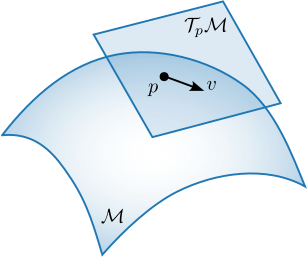

Riemannian Geometry
===================

This page provides the minimal vocabulary necessary to follow the rest of the
documentation and use geodex effectively. It is not an exhaustive introduction to
differential geometry. For a rigorous treatment of Riemannian geometry, see
:cite:`Lee2018`. For readers interested in the computational aspects relevant to this
library, see :cite:`Boumal2023` and :cite:`Absil2008`.

A **smooth manifold** :math:`\mathcal{M}` is a topological space that locally looks
like a familiar Euclidean space :math:`\mathbb{R}^n`. Each point :math:`p \in
\mathcal{M}` has an associated **tangent space** :math:`\mathcal{T}_p\mathcal{M}`, the
vector space of all instantaneous velocities passing through :math:`p`. Tangent vectors
:math:`v \in \mathcal{T}_p\mathcal{M}` are the directions in which you can move on the
manifold.

A **Riemannian metric** :math:`g` equips every tangent space with a smoothly varying
inner product:

.. math::

   g_p : \mathcal{T}_p\mathcal{M} \times \mathcal{T}_p\mathcal{M} \to \mathbb{R}

This inner product allows us to define lengths and angles on the manifold. The **norm**
of a tangent vector :math:`v \in \mathcal{T}_p\mathcal{M}` is defined as:

.. math::

   \|v\|_p = \sqrt{g_p(v, v)}

**Geodesics** :math:`\gamma` are the generalization of straight lines in flat spaces to
manifolds. They are locally length-minimizing curves with zero acceleration.

The **exponential map** :math:`\exp_p : \mathcal{T}_p\mathcal{M} \to \mathcal{M}`
follows the geodesic starting at :math:`p` with initial velocity :math:`v`:

.. math::

   \exp_p(v) = \gamma(1), \quad \dot\gamma(0) = v

The **logarithmic map** :math:`\log_p : \mathcal{M} \to \mathcal{T}_p\mathcal{M}` is
the local inverse of the exponential map: it returns the tangent vector at :math:`p`
pointing toward :math:`q`:

.. math::

   \log_p(q) = v \quad\Longleftrightarrow\quad \exp_p(v) = q

The **geodesic distance** between two points is the length of the shortest connecting
geodesic:

.. math::

   d(p, q) = \|\log_p(q)\|_p

This formula requires exact exp/log. When only approximations are available, geodex
falls back to the midpoint approximation, which is covered alongside the discrete
interpolation algorithm in :doc:`discrete-geodesic-interpolation`.

**Retractions** are first- or second-order approximations to the exponential map. They
are cheaper to evaluate and preserve the manifold topology, but unlike the true
exponential they are not isometries. geodex separates retractions from metrics as
independent policy types, as discussed in :doc:`architecture`.

References
----------

.. bibliography::
   :filter: docname in docnames
