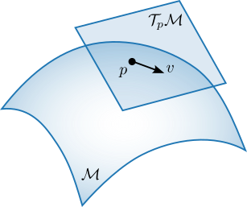

Riemannian Geometry
===================

This page defines the terms of Riemannian geometry that the rest of the documentation uses.
Lee's textbook covers the subject in full :footcite:`Lee2018`, and the books of Boumal and of
Absil, Mahony and Sepulchre cover its computational side :footcite:`Boumal2023,Absil2008`.

A **smooth manifold** :math:`\mathcal{M}` is a space that looks like :math:`\mathbb{R}^n`
near each of its points. Each point :math:`p \in \mathcal{M}` has a **tangent space**
:math:`\mathcal{T}_p\mathcal{M}`, the vector space of the velocities of curves through
:math:`p`. A tangent vector :math:`v \in \mathcal{T}_p\mathcal{M}` is a direction of motion on
the manifold.

A **Riemannian metric** :math:`g` assigns every tangent space an inner product that varies
smoothly with the point,

.. math::

   g_p : \mathcal{T}_p\mathcal{M} \times \mathcal{T}_p\mathcal{M} \to \mathbb{R}.

The metric defines lengths and angles on the manifold. The **norm** of a tangent vector
:math:`v \in \mathcal{T}_p\mathcal{M}` is

.. math::

   \|v\|_p = \sqrt{g_p(v, v)},

and the length of a curve is the integral of the norm of its velocity.

**Geodesics** generalize straight lines to manifolds. A geodesic :math:`\gamma` has zero
acceleration, and it is the shortest curve between any two of its points that lie close
enough together.

The **exponential map** :math:`\exp_p : \mathcal{T}_p\mathcal{M} \to \mathcal{M}` follows the
geodesic that starts at :math:`p` with initial velocity :math:`v` for unit time,

.. math::

   \exp_p(v) = \gamma(1), \quad \gamma(0) = p, \quad \dot\gamma(0) = v.

The **logarithmic map** :math:`\log_p : \mathcal{M} \to \mathcal{T}_p\mathcal{M}` is the local
inverse of the exponential map. It returns the tangent vector at :math:`p` that points toward
:math:`q`,

.. math::

   \log_p(q) = v \quad\Longleftrightarrow\quad \exp_p(v) = q.

The **geodesic distance** between two points is the length of the shortest curve between
them. For :math:`q` close enough to :math:`p`,

.. math::

   d(p, q) = \|\log_p(q)\|_p.

This formula needs the exponential and logarithmic maps of the metric in use. Under a
general metric, geodex's ``distance`` evaluates the metric at the midpoint of the pair, a
third-order approximation :footcite:`kyaw2026geometry`, and ``discrete_geodesic`` computes the
geodesic itself (see :doc:`discrete-geodesic-interpolation`).

A **retraction** :math:`R_p : \mathcal{T}_p\mathcal{M} \to \mathcal{M}` maps a tangent vector
to a point of the manifold and agrees with the exponential map to first order,
:math:`R_p(0) = p` and :math:`\mathrm{d}R_p(0) = \mathrm{id}`. A second-order retraction
agrees with the exponential map to second order. Retractions are cheaper to evaluate than the
exponential map. geodex keeps the retraction and the metric as separate policy types, as
described in :doc:`architecture`.

References
----------

.. footbibliography::
