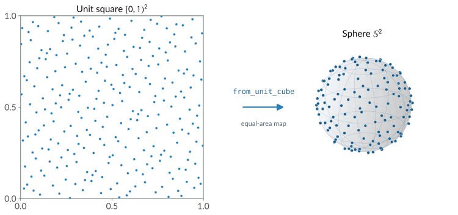
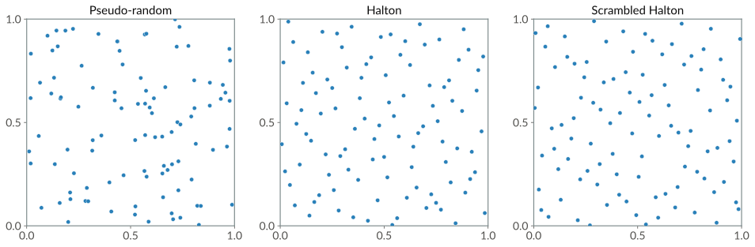

Sampling on Manifolds
=====================

Planners and many other algorithms take random samples from a space, and their results depend
on how those samples are spread. **Sampling** on a manifold means picking a point of the
manifold from a distribution that is uniform with respect to the manifold's own volume. Naive
approaches on a curved space cluster points, for example near the poles of a sphere or along
one axis of a rotation group. This page covers how geodex samples uniform points on a manifold,
and how to choose the sampler and seed it.

From the unit cube to the manifold
----------------------------------

geodex splits sampling into two stages that meet at the unit cube. A **sampler** fills a
vector with uniform coordinates in :math:`[0,1)^n` and does not depend on the manifold. Each
manifold provides a **measure-preserving map** ``from_unit_cube`` that maps the cube onto the
manifold, equal volumes of the cube onto equal volumes of the manifold. A random point
is a unit-cube vector from the sampler pushed through ``from_unit_cube``. The number of cube
coordinates a manifold uses is ``unit_cube_dim()``. Most manifolds use as many coordinates as
their dimension (two for the 2-sphere, three for :math:`\mathrm{SO}(3)` and six for
:math:`\mathrm{SE}(3)`), and an :math:`n`-sphere with :math:`n \ge 3` uses :math:`n+1`.

Every manifold in geodex holds a sampler of its own, one of the same few kinds, and the map
changes from one manifold to the next. The table below gives the cube dimension and the map
of each built-in manifold.

.. list-table::
   :header-rows: 1
   :widths: 34 14 52

   * - Manifold
     - Cube dim
     - Map onto the manifold
   * - :math:`\mathbb{R}^n`
     - n
     - affine rescale of each coordinate
   * - :math:`\mathbb{T}^n`
     - n
     - affine rescale of each angle
   * - :math:`\mathrm{SO}(2)`
     - 1
     - affine rescale of the angle
   * - :math:`\mathrm{SE}(2)`
     - 3
     - affine on position and heading
   * - :math:`\mathbb{S}^2`
     - 2
     - cylindrical equal-area
   * - :math:`\mathbb{S}^n,\ n \ge 3`
     - n+1
     - inverse-CDF normals, then normalize
   * - :math:`\mathrm{SO}(3)`
     - 3
     - Shoemake uniform quaternion
   * - :math:`\mathrm{SE}(3)`
     - 6
     - affine translation plus Shoemake

On :math:`\mathbb{S}^2`, the cylindrical equal-area map takes a height coordinate and an
angle coordinate to a point. Projecting a sphere onto its bounding cylinder preserves area
(Archimedes' hat-box theorem) :footcite:`marsaglia1972`. In higher dimensions, geodex samples
:math:`n+1` standard normals through the inverse normal CDF and normalizes them. A normalized
standard Gaussian vector is uniform on :math:`\mathbb{S}^n` :footcite:`muller1959`. Rotations
use Shoemake's construction, which builds a Haar-uniform unit quaternion from three uniform
coordinates :footcite:`shoemake1992`.

A new C++ manifold implements ``unit_cube_dim`` and ``from_unit_cube`` to support sampling.
In Python, ``random_point``, ``seed`` and the ``sampler=`` constructor argument control
sampling.

   Even coverage of the unit square becomes even coverage of the sphere. The left panel is a
   scrambled Halton set in :math:`[0,1)^2`, and ``from_unit_cube`` maps it onto
   :math:`\mathbb{S}^2` through the cylindrical equal-area map.

Even coverage
-------------

Independent pseudo-random samples are uniform on average, and any finite set of them clumps
in some places and leaves gaps in others. geodex samples from a **low-discrepancy sequence**,
the Halton sequence, whose every prefix fills the space evenly. It trades statistical
independence for coverage. The comparison below shows 100 points of each.

   100 points in the unit square. Pseudo-random samples clump and leave gaps, while the Halton and
   scrambled Halton sequences spread evenly.

The **star discrepancy** measures how evenly a point set covers the cube. Take a set
:math:`P` of :math:`N` points in :math:`[0,1)^d`, and any box
:math:`B = [0, b_1) \times \cdots \times [0, b_d)` anchored at the origin. For evenly spread
points, the fraction of them inside :math:`B` tracks the volume of :math:`B`. The star
discrepancy is the largest gap between that fraction and that volume, over every such box,

.. math::

   D_N^*(P) \;=\; \sup_{B}\, \left| \frac{\#(P \cap B)}{N} - \operatorname{vol}(B) \right|.

Independent uniform samples reduce this discrepancy at the Monte Carlo rate, and a Halton
set of the same size does asymptotically better,

.. math::

   D_N^*(\text{i.i.d.}) = O\bigl(N^{-1/2}\bigr), \qquad
   D_N^*(\text{Halton}) = O\left( \frac{(\log N)^d}{N} \right).

The second bound replaces :math:`\sqrt{N}` by :math:`N` in the denominator, at the cost of a
:math:`(\log N)^d` factor in the numerator. For moderate dimensions :math:`d`, the
:math:`1/N` factor is a large improvement over :math:`1/\sqrt{N}`. The :math:`(\log N)^d`
factor grows with dimension, and the sample count at which Halton overtakes pseudo-random
sampling grows with it. Around ten to fourteen dimensions, that sample count exceeds any
practical one. Sampling-based planners also use quasi-random sequences
:footcite:`branicky2001`. In motion planning, the resolution and optimality guarantees of
sampling-based planners depend on **dispersion**, the radius of the largest empty ball in the
space, rather than on discrepancy :footcite:`lavalle2006,janson2018`. geodex samples from a
scrambled Halton sequence by default.

.. raw:: html
   :file: ../_static/sampling-explorer.html

The samplers
------------

geodex provides three samplers.

1) ``ScrambledHaltonSampler``, the default, is a randomized Halton sequence in which each
   prime base has an independent random permutation of its digits and a random starting
   index :footcite:`braaten1979,owen2017`. The scramble removes the correlation between
   dimensions that plain Halton develops in higher dimensions, and each seed gives a
   different point set that is itself low-discrepancy.

2) ``HaltonSampler`` is the plain deterministic sequence, each coordinate a van der Corput
   radical inverse in a distinct prime base :footcite:`vandercorput1935,halton1960`.

3) ``PseudoRandomSampler`` wraps ``std::mt19937`` and returns independent uniform samples.
   Use it where independence matters more than coverage.

All three satisfy the concept :cpp:concept:`geodex::Sampler`. Its member ``sample(n, out)``
fills the first ``n`` entries of a vector with uniform values in :math:`[0,1)`. A sampler
that can be reseeded also satisfies :cpp:concept:`geodex::SeedableSampler`, which adds
``seed(s)``. See :doc:`architecture` for how the concepts relate.

Using a sampler on a manifold
-----------------------------

``random_point()`` samples one uniform configuration through the manifold's own map.

.. code-pair:: concepts/sampling random-point

In C++, the sampler is the last template argument of a manifold, and a manifold with another
sampler is another type. In Python, the ``sampler=`` constructor keyword or ``set_sampler``
chooses it.

.. code-pair:: concepts/sampling choose-sampler

``seed`` on a manifold reseeds the sampler behind its ``random_point``, and two manifolds
seeded with the same value give the same sequence. ``geodex.seed`` in Python, or
``geodex::set_default_seed`` in C++, reseeds the shared source that default-constructed
samplers take their seeds from. Every manifold constructed afterwards samples a reproducible
sequence.

.. code-pair:: concepts/sampling seed

The planner samples through copies of the manifold's sampler, each reseeded to give its own
sequence, a separate scramble of the Halton sequence under the default sampler. A nonzero
``PlanSettings.seed`` seeds those copies and leaves the manifold's sampler as it was. An
unseeded plan takes its seed from the manifold's sampler and advances it (see
:doc:`/getting-started/reproducibility`). The planner also uses a sampler chosen on a
manifold, for example ``sampler="halton"``.

A **product manifold** composes several manifolds into one configuration space, built with
``Product`` in Python or ``make_product`` in C++. A point of the product is one point of each
factor stacked together. An :math:`\mathrm{SE}(2) \times \mathbb{R}^n` product pairs a base pose
with a vector of joint angles, and an :math:`\mathrm{SO}(3) \times \mathbb{R}^3` product pairs
an orientation with a position. Each factor keeps its own geometry and its own map from the
unit cube.

geodex samples the whole product with one joint sampler over a single unit cube whose
dimension is the sum of the factors' ``unit_cube_dim()``. A Halton sampler, the default
included, gives every coordinate of every factor a distinct prime base, and the samples of the
product form one low-discrepancy sequence. ``random_point`` on a product works as on any other
manifold.

.. code-pair:: concepts/sampling product

Using a sampler on its own
--------------------------

A sampler on its own gives well-spread points in the unit cube.

.. code-pair:: concepts/sampling standalone

In C++, ``sample`` writes into a caller-provided ``Eigen::Ref``, one buffer reused across
samples. In Python, it returns a new array of length ``n``. Each call advances the sequence,
and a loop of calls gives successive low-discrepancy points.

Custom samplers and new manifolds
---------------------------------

A sampler is a concept, and any type with the right ``sample`` signature is a sampler. The
Kronecker sampler below fills coordinate :math:`i` of point :math:`k` with the fractional
part of :math:`k\sqrt{p_i}` for the :math:`i`-th prime :math:`p_i`, a low-discrepancy
sequence of its own, and satisfies :cpp:concept:`geodex::Sampler`. Its
``void seed(std::uint64_t)`` member makes it a :cpp:concept:`geodex::SeedableSampler` that
manifolds can reseed. Any manifold accepts it as its ``SamplerT`` template argument. Custom
samplers work in C++ only.

.. code-pair:: concepts/sampling custom-sampler
   :only: cpp

A new manifold implements ``unit_cube_dim()`` and the map ``from_unit_cube(u)``. The map must
be measure-preserving for the result to be uniform, and separable where possible, one cube
coordinate feeding one manifold coordinate, to preserve the low discrepancy of the sequence
:footcite:`okten2011`.

See also
--------

- :doc:`architecture` for the policy-based design that samplers plug into.
- :doc:`/tutorials/geodex-basics` for ``random_point`` on every built-in manifold.
- :doc:`/api/cpp` for the reference entries of every sampler named here.

References
----------

.. footbibliography::
