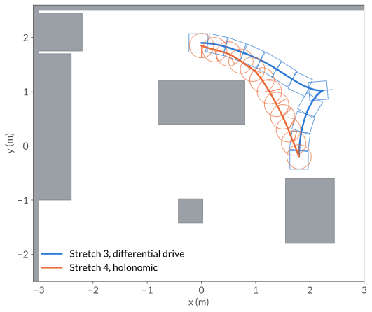
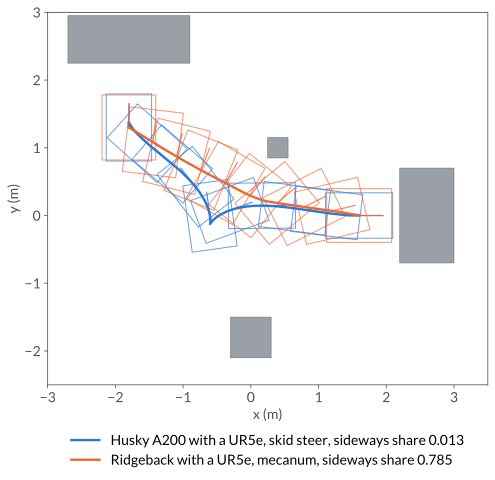

Whole-Body Planning
===================

In this guide, we plan a Hello Robot Stretch 3 from beside a kitchen table to the far side of
the island, moving its base and its arm in one motion. Then we plan the same task for a
Stretch 4, whose base can slide sideways. The same steps plan a UR5e on two Clearpath bases.

.. robot-scene:: robots-stretch-3
   :hero:
   :alt: A Stretch 3 driving from the table around the island and reaching over it, with faint
         copies along the path.

   The finished plan. The grey curve traces the base on the floor and the blue curve the
   gripper. Drag to orbit, and use the controls to pause the robot or move it along the path.

.. _whole-body-stretch:

Hello Robot Stretch 3 and Stretch 4
-----------------------------------

The full script is ``examples/robots/mobile_manipulation/stretch.py``, and the C++ version is
``examples/robots/mobile_manipulation/stretch.cpp``.

1. Load the robot and the kitchen
^^^^^^^^^^^^^^^^^^^^^^^^^^^^^^^^^

``geodex.robots.Stretch3`` is the robot's configuration space. A configuration is the base
pose :math:`(x, y, \theta)` followed by the lift, the arm extension and the three wrist
joints. ``workspace`` is the rectangle the planner samples base positions from. The kitchen
is a scene file of boxes, :download:`kitchen.yaml
</../examples/robots/mobile_manipulation/scenes/kitchen.yaml>`, in a ``scenes``
directory next to the script.

.. code-pair:: robots/mobile_manipulation/stretch load

It prints ``stretch3 drive: differential_drive coordinates: 8``. The Stretch 3 rolls on two
wheels and a caster, and its default base metric is the differential-drive one.

2. Plan the motion
^^^^^^^^^^^^^^^^^^

The start has the wrist tucked beside the table, and the goal holds the gripper over the
island. The Stretch 3's arm points to the right of its base.
``PlanSettings(iterations=1500, seed=1, collision_check_resolution=0.005)`` gives the planner
1500 iterations and a fixed seed, and checks the path every 5 mm of sphere motion.

.. code-pair:: robots/mobile_manipulation/stretch plan

It prints ``solved=True cost=5.332 waypoints=641``. The cost is the length of the path under
the robot's metric. On a laptop CPU (Intel Core i7-10875H), the planner finds a first path in
1.3 ms, after 57 iterations. The 1500 iterations take 55 ms, and smoothing takes 67 ms.
``result.first_solution_ms``, ``result.time_ms`` and ``result.smooth_ms`` hold these times.

.. _whole-body-sideways:

3. Measure how much the base slides
^^^^^^^^^^^^^^^^^^^^^^^^^^^^^^^^^^^

Between two waypoints, the base moves along one constant body twist
:math:`(v_x, v_y, \omega)`, the SE(2) logarithm of the two base poses. ``sideways_share``
adds up the sideways part :math:`|v_y|` of every edge and divides it by the base's travel.

.. code-pair:: robots/mobile_manipulation/stretch sideways

It prints ``sideways share=0.010``. Almost none of the Stretch 3's base travel is sideways.

4. Try it: plan the Stretch 4
^^^^^^^^^^^^^^^^^^^^^^^^^^^^^

``geodex.robots.Stretch4`` rolls on three omniwheels, and its default base metric is the
holonomic one. Its arm points forward, and its goal faces the island.

.. code-pair:: robots/mobile_manipulation/stretch try-it

It prints ``solved=True cost=4.580 sideways share=0.684``. Two thirds of the Stretch 4's base
travel is sideways. The plan finds a first path in 2.6 ms and takes 80 ms with smoothing. The
two costs are lengths under two different metrics.

.. robot-scene:: robots-stretch-4
   :alt: A Stretch 4 sliding from the table around the island and reaching over it, with faint
         copies along the path.

   The Stretch 4 plan, drawn the same way with the gripper trace in orange.

         path in orange, base outlines and headings drawn along each.

   The two base paths from above, with the base outline and its heading at twelve evenly
   spaced points. The Stretch 3 (blue) drives forward past the island, stops, and backs into
   its goal. The Stretch 4 (orange) slides and turns at the same time.

The base metric weighs the forward, sideways and turning speeds of the base,

.. math::

   \|\dot q_{\text{base}}\|^2 = w_x v_x^2 + w_y v_y^2 + w_\theta\, \omega^2 ,

and the ``base`` argument of a mobile robot picks the weights.

.. list-table::
   :header-rows: 1
   :widths: 30 25 45

   * - ``base``
     - :math:`(w_x, w_y, w_\theta)`
     - Use it for
   * - ``"holonomic"``
     - (1, 1, 1)
     - omniwheels and mecanum wheels
   * - ``"differential_drive"``
     - (1, 100, 1)
     - two driven wheels, skid steer

With :math:`w_y = 100`, a meter of sliding costs as much as ten meters of driving. For other
weights, pass ``base_weights=(wx, wy, wtheta)``.

.. plotly-figure:: robots-stretch-sideways
   :alt: Line chart of the sideways component of the base velocity along both paths. The
         Stretch 4 path slides between minus and plus one, the Stretch 3 path stays near zero.

   The sideways component of the base's velocity, :math:`v_y / \sqrt{v_x^2 + v_y^2}`, along
   the two paths. The curves break where the base turns almost in place.

.. _whole-body-clearpath:

Clearpath Husky and Ridgeback with a UR5e
-----------------------------------------

Here, we plan one workcell task for a UR5e on a Clearpath Husky A200 and on a Clearpath
Ridgeback. Each robot starts beside the shelf with its arm folded and ends at the low table with
the tool flange above it, pointing down.

         in orange, chassis outlines and headings drawn along each.

   The two base paths from above, with the chassis outline and its heading at ten evenly
   spaced points. The Husky (blue) backs out of the shelf bay, stops, and drives forward to
   the table. The Ridgeback (orange) slides out of the bay diagonally and turns on the way.

The full script is ``examples/robots/mobile_manipulation/clearpath.py``, and the C++ version is
``examples/robots/mobile_manipulation/clearpath.cpp``.

1. Load the workcell and the Husky
^^^^^^^^^^^^^^^^^^^^^^^^^^^^^^^^^^

``geodex.robots.HuskyUR5e`` is the robot's configuration space, the base pose
:math:`(x, y, \theta)` followed by the six UR5e joints. The workcell is a scene file of boxes
and cylinders, :download:`workcell.yaml
</../examples/robots/mobile_manipulation/scenes/workcell.yaml>`, in a ``scenes``
directory next to the script.

.. code-pair:: robots/mobile_manipulation/clearpath load

It prints ``husky_ur5e drive: differential_drive coordinates: 9``. The Husky is a skid-steer
base, and its default base metric is the differential-drive one.

2. Plan the Husky
^^^^^^^^^^^^^^^^^

The plan uses the settings of the Stretch 3 with 1000 iterations.

.. code-pair:: robots/mobile_manipulation/clearpath plan

It prints ``solved=True cost=6.877``. The planner finds a first path in 0.7 ms, after 8
iterations. The 1000 iterations take 117 ms, and smoothing takes 117 ms.

.. robot-scene:: robots-husky-ur5e
   :alt: A Husky with a UR5e driving from a shelf past a pillar to a table and reaching over it,
         with faint copies along the path.

   The Husky plan. The grey curve traces the base and the blue curve the tool flange.

3. Measure how much the Husky slides
^^^^^^^^^^^^^^^^^^^^^^^^^^^^^^^^^^^^

``sideways_share`` measures the Husky's base as in :ref:`step 3 <whole-body-sideways>` of the
Stretch 3.

.. code-pair:: robots/mobile_manipulation/clearpath sideways

It prints ``sideways share=0.013``.

4. Try it: plan the Ridgeback
^^^^^^^^^^^^^^^^^^^^^^^^^^^^^

The Ridgeback rolls on mecanum wheels, and its default base metric is the holonomic one. The
start, the goal and the settings stay the same.

.. code-pair:: robots/mobile_manipulation/clearpath try-it

It prints ``solved=True cost=4.688 sideways share=0.785``. More than three quarters of the
Ridgeback's base travel is sideways. The plan finds a first path in 3.3 ms and takes 129 ms
with smoothing.

.. robot-scene:: robots-ridgeback-ur5e
   :alt: A Ridgeback with a UR5e sliding from a shelf around a pillar to a table and reaching
         over it, with faint copies along the path.

   The Ridgeback plan, drawn the same way with the flange trace in orange.

Where to go next
----------------

- :doc:`/concepts/metrics` covers the left-invariant metric of the base and the
  kinetic-energy metric of the arm.
- :doc:`/api/index` covers ``make_product`` and ``heuristics::product_lower_bound``, which build
  a whole-body space and its heuristic for any base and arm.
- ``metric="euclidean"`` measures the arm by its joint angles instead of its kinetic energy, as
  in :doc:`manipulation`.
- :doc:`add-a-robot` generates the collision model, mass matrix and bound for another mobile
  manipulator.
- :ref:`robot-collision-checking` covers how geodex checks a robot against the scene.
