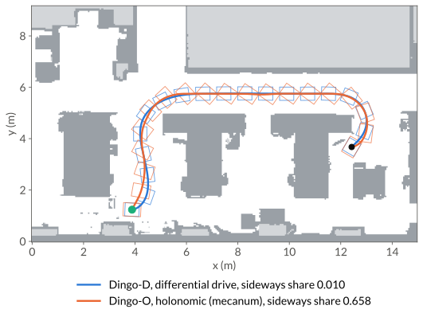

Navigation
==========

In this guide, we plan three Clearpath mobile bases through the aisles of an office, from the
lower aisle into a gap between two desks. The drive of a base changes only the weights of its
metric.

.. plotly-figure:: robots-nav-bases
   :alt: Office map with walls and rows of desks, with the path of the selected Clearpath base
         and its footprint outline drawn along it.

   The path of each base, with its footprint every 0.8 m. Pick a base in the menu, and hover
   over a path to read the heading.

The full script is ``examples/robots/navigation/bases.py``, and the C++ version is
``examples/robots/navigation/bases.cpp``.

1. Load the office map
----------------------

The map is a 15 m by 9.2 m section of an office floor that a Clearpath Jackal mapped with
Cartographer, at 0.05 m per cell. ``office_dist.txt`` holds the signed distance to the nearest
occupied or unknown cell at the center of every cell, and ``office_grid`` loads it into a
``DistanceGrid``.

.. code-pair:: robots/navigation/bases map

2. Plan for a Jackal
--------------------

``plan_base`` plans through the office for a rectangular base. A base pose is
:math:`(x, y, \theta)`, and the base metric weighs the forward, sideways and turning speeds
:math:`(v_x, v_y, \omega)` in the base's own frame,

.. math::

   \|\dot q\|^2 = w_x v_x^2 + w_y v_y^2 + w_\theta\, \omega^2 .

A ``FootprintGridChecker`` tests the footprint against the grid with a 5 cm safety margin. Its
signed clearance :math:`d(q)` is the smallest distance over the footprint's outline. The
clearance metric multiplies the base metric by :math:`1 + \kappa\, e^{-\beta\, d(q)}`. The
planner adds edges of at most ``planner_range`` to its tree, a length under the metric. The
Jackal is 0.508 m by 0.430 m with the weights (1, 50, 2) and a planner range of 6.5. The goal
lies in a gap between two desks.

.. code-pair:: robots/navigation/bases plan

It prints ``solved=True cost=23.457 waypoints=1972``.

.. grid:: 3
   :gutter: 2

   .. grid-item-card:: 46 ms
      :class-card: geodex-stat

      planning time

   .. grid-item-card:: 1.0 ms
      :class-card: geodex-stat

      first solution

   .. grid-item-card:: 1000
      :class-card: geodex-stat

      iterations

The times are from a laptop CPU (Intel Core i7-10875H). The planner finds the first path after
145 iterations. The 1000 iterations take 30 ms, and smoothing takes 16 ms.
``result.first_solution_ms``, ``result.time_ms`` and ``result.smooth_ms`` hold these times.

In the figure at the top, the Jackal drives along the lower aisle and turns up between the two
middle desks into the upper aisle. It follows the upper aisle and turns down into the goal.

With :math:`w_y = 50`, a meter of sliding costs as much as about 7 m of driving
(:math:`\sqrt{50}`). With :math:`\kappa = 1.5` and :math:`\beta = 3`, the clearance metric
makes a motion 1.58 times as long at zero clearance, 1.16 times at 0.5 m and 1.04 times at
1 m.

3. Measure how much the base slides
-----------------------------------

Between two waypoints, the base moves along one constant body twist
:math:`(v_x, v_y, \omega)`, the SE(2) logarithm of the two poses. ``sideways_share`` adds up
:math:`|v_y|` over the edges and divides it by the base's travel.

.. code-pair:: robots/navigation/bases sideways

It prints ``sideways share=0.021``.

4. Try it: plan every base
--------------------------

``PLATFORMS`` lists three bases with their footprints, drives and planner ranges, and
``DRIVES`` holds the weights of each drive. The skid-steer Jackal turns with twice the weight of
the differential drive, and the mecanum Dingo-O has equal forward and sideways weights. The
larger Clearpath bases, the Husky and the Ridgeback, do not fit into the gap at the goal.

.. code-pair:: robots/navigation/bases try-it

It prints

.. code-block:: text

       jackal: solved=True cost=23.46 sideways share=0.021
      dingo_d: solved=True cost=22.81 sideways share=0.010
      dingo_o: solved=True cost=20.37 sideways share=0.658

Every base finds a first path within 1.0 ms, and every plan takes at most 46 ms with
smoothing. The Dingo-D and the Dingo-O share their chassis width and differ in drive. Both take
the aisle on the left and the upper aisle. The differential-drive Dingo turns into each aisle
and drives forward. The mecanum Dingo turns less and slides for most of its travel.

         footprints drawn every 0.8 m.

   The Dingo-D (blue) and the Dingo-O (orange), with the start in green and the goal in
   black.

.. tab-set::

   .. tab-item:: Dingo-D, differential drive

      .. robot-scene:: robots-nav-dingo-d
         :alt: A Clearpath Dingo-D driving between the desks of the office along its path, with
               faint copies of the robot along the path and the trace of its base in
               blue.

         The Dingo-D plan in 3D. The blue curve traces the center of its base.

   .. tab-item:: Dingo-O, mecanum

      .. robot-scene:: robots-nav-dingo-o
         :alt: A Clearpath Dingo-O driving between the desks of the office along its path, with
               faint copies of the robot along the path and the trace of its base in
               orange.

         The Dingo-O plan in 3D, drawn the same way with the trace in orange.

Where to go next
----------------

- :doc:`/ros2/nav2` plans the same query on the same map in a Nav2 planner server, with
  footprints and weights for four Clearpath bases.
- :doc:`/tutorials/se2-planning` covers footprints, costmaps and the clearance metric in more
  depth, with a motion validator for bases that should not reverse.
- :doc:`mobile-manipulation` puts an arm on the base.
- :doc:`/concepts/metrics` covers left-invariant and clearance metrics.
