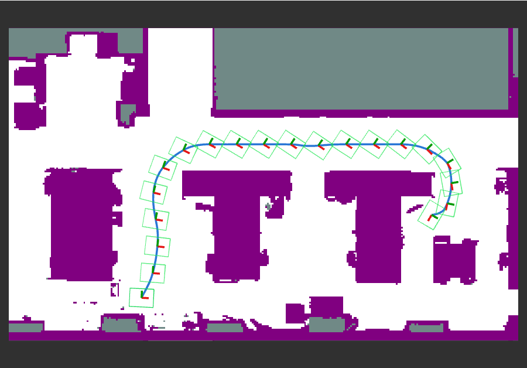

Nav2 Global Planner
===================

``geodex_nav2_planner`` is a global planner plugin for `Nav2 <https://docs.nav2.org>`_. It plans
a path on :math:`\mathrm{SE}(2)` for the robot's footprint, under a metric that weights forward,
sideways and turning motion. In this guide, we plan a path for a Clearpath Jackal between the
desks of an office, and plan again for a holonomic base.

         desks, a blue path from the lower left that climbs the aisle left of the desks, runs
         along the upper aisle and turns down into a gap between two desks on the right, and
         green footprint rectangles along the path.

   The plan for a Jackal on the office map, with its footprint along the path.

1. Build the plugin
-------------------

.. code-block:: bash

   git clone https://github.com/utiasSTARS/geodex_nav2_planner.git
   cd geodex_nav2_planner
   pixi run -e jazzy build

See :doc:`index` for the build in a colcon workspace.

2. Launch the demo
------------------

The launch starts a map server with the office map, a planner server with the plugin and the
Jackal's parameters, and RViz.

.. code-block:: bash

   pixi shell -e jazzy
   source install/jazzy/setup.bash
   ros2 launch geodex_nav2_planner office.launch.py robot:=jackal rviz:=true

3. Request a path
-----------------

In a second shell of the same environment, send the request.

.. code-block:: bash

   ros2 run geodex_nav2_planner office_plan.py

It prints the result, and RViz shows the path of the figure at the top.

.. code-block:: text

   error_code=0 poses=6615 length=14.421 m planning_time=34 ms

.. grid:: 3
   :gutter: 2

   .. grid-item-card:: 34 ms
      :class-card: geodex-stat

      planning time

   .. grid-item-card:: 1000
      :class-card: geodex-stat

      iterations

   .. grid-item-card:: 14.42 m
      :class-card: geodex-stat

      path length

The time is from an Intel Core i7-10875H. The demo sets a seed, the iteration budget and the
planner's range. Request the path again and you get the same poses.

.. literalinclude:: sources/geodex_nav2_planner/config/office.yaml
   :language: yaml
   :start-at: planner_server:
   :caption: config/office.yaml

4. Try it: plan for a Dingo-O
-----------------------------

Stop the launch, start it again with ``robot:=dingo_o``, and request the path again.

.. code-block:: bash

   ros2 launch geodex_nav2_planner office.launch.py robot:=dingo_o rviz:=true
   ros2 run geodex_nav2_planner office_plan.py

.. code-block:: text

   error_code=0 poses=898 length=14.573 m planning_time=28 ms

Only the robot file changes. The Dingo-O's file sets equal forward and sideways weights, and its
footprint slides sideways up the aisle where the Jackal turns and drives forward.

.. grid:: 3
   :gutter: 2

   .. grid-item-card:: 28 ms
      :class-card: geodex-stat

      planning time

   .. grid-item-card:: 1000
      :class-card: geodex-stat

      iterations

   .. grid-item-card:: 14.57 m
      :class-card: geodex-stat

      path length

         whose green rectangles face right while the path climbs the aisle left of the desks.

   The same request for a Dingo-O. Its footprint slides sideways up the aisle.

Switch the metric per robot
---------------------------

The metric weights ``wx``, ``wy`` and ``wtheta`` weigh forward, sideways and turning motion.
Use a large sideways weight, 50 by default, for a differential-drive or skid-steer base, and
equal forward and sideways weights for a holonomic base. For a holonomic base, also set
``max_reverse_run: -1.0``. The plugin's ``config/robots`` has a file for each of four Clearpath
bases.

.. include:: generated/nav2_robots.inc

.. tab-set::

   .. tab-item:: Jackal, skid steer

      .. literalinclude:: sources/geodex_nav2_planner/config/robots/jackal.yaml
         :language: yaml
         :start-at: planner_server:

   .. tab-item:: Ridgeback, mecanum

      .. literalinclude:: sources/geodex_nav2_planner/config/robots/ridgeback.yaml
         :language: yaml
         :start-at: planner_server:

   .. tab-item:: Husky, skid steer

      .. literalinclude:: sources/geodex_nav2_planner/config/robots/husky.yaml
         :language: yaml
         :start-at: planner_server:

   .. tab-item:: Dingo-O, mecanum

      .. literalinclude:: sources/geodex_nav2_planner/config/robots/dingo_o.yaml
         :language: yaml
         :start-at: planner_server:

The planner checks the footprint against the lethal cells of the global costmap. The costmap
does not need an inflation layer.

Visualization
-------------

With ``publish_footprints: true``, the plugin publishes the footprint outline and an orientation
frame at poses along the path, as a ``visualization_msgs/MarkerArray`` on
``/planner_server/<plugin name>/path_footprints``. ``marker_spacing`` sets the distance between
the markers.

Parameters
----------

.. include:: generated/nav2_parameters.inc

Where to go next
----------------

- :doc:`/robots/navigation` plans the same query on the same map with geodex directly.
- :doc:`/concepts/smoothing` covers the smoother and what it checks.
- :doc:`moveit` plans arm motions through MoveIt 2.
