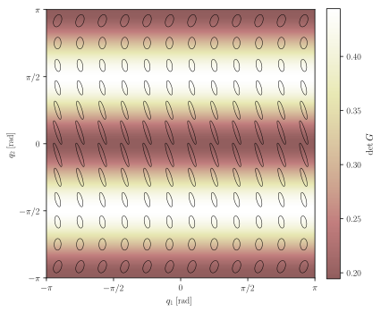
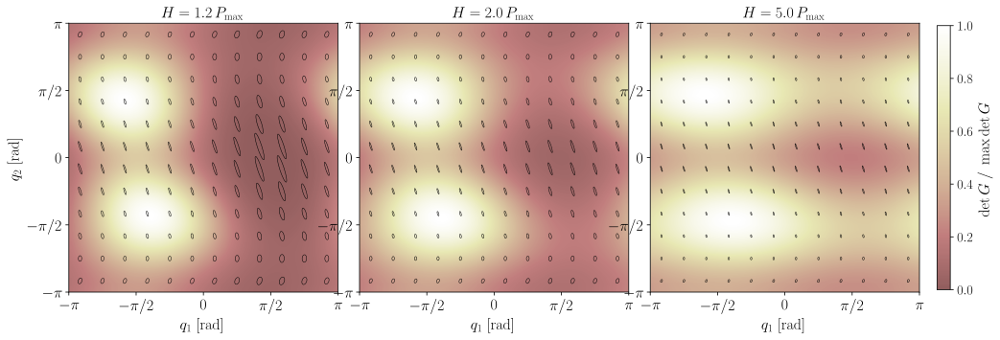
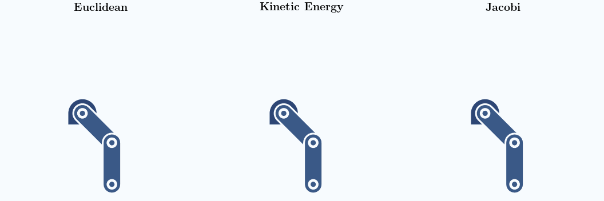

Minimum-Energy Planning on Configuration Manifolds
==================================================

This tutorial shows how we can use geodex to find minimum-energy motions for robot configuration spaces modeled as Riemannian manifolds.
To keep things simple, we will only work in two dimensions, using a two-link planar manipulator as the running example.
We will make use of two Riemannian metrics widely used in the literature for energy-aware planning for articulated systems: the **Kinetic Energy metric** and the **Jacobi metric** (see :cite:`kyaw2026geometry,li2024riemannian,jaquier2022riemannian`).

Setting up Our Planar Manipulator
---------------------------------

To begin, we will model the standard two-link planar arm with the following parameters:

.. list-table::
   :header-rows: 1
   :widths: 20 20 50

   * - Symbol
     - Default
     - Description
   * - :math:`l_1, l_2`
     - 1.0 m
     - Link lengths
   * - :math:`m_1, m_2`
     - 1.0 kg
     - Link masses
   * - :math:`l_{c1}, l_{c2}`
     - 0.5 m
     - CoM distances from joint (:math:`l/2` for uniform rods)
   * - :math:`I_1, I_2`
     - 1/12 kg·m²
     - Moments of inertia (:math:`m l^2 / 12`)
   * - :math:`g`
     - 9.81 m/s²
     - Gravitational acceleration

Kinetic Energy Metric
---------------------

The *kinetic energy metric* at configuration :math:`q` is defined by the manipulator's mass matrix :math:`M(q)`:

.. math::

   \langle u, v \rangle_q = u^\top M(q)\, v.

A path :math:`\gamma` in configuration space has Riemannian arc-length

.. math::

   \ell(\gamma) = \int_0^1 \sqrt{\dot\gamma^\top M(\gamma)\, \dot\gamma}\; dt,

which is precisely the "kinematic effort" or the energy required to execute :math:`\gamma` at unit speed.
Geodesics of this metric are straight lines in the inertia-weighted sense: they minimize the total effort while respecting the arm's inertial structure :cite:`BulloLewis2004`.
Because :math:`M(q)` depends on each configuration, the metric is anisotropic and varies across the manifold.

Defining the Mass Matrix
^^^^^^^^^^^^^^^^^^^^^^^^

To compute the kinetic energy of the manipulator, we need its mass matrix :math:`M(q)`.
For a standard two-link planar arm, the mass matrix can be derived from the Euler-Lagrange equations.
The components of this :math:`2 \times 2` symmetric matrix are defined as:

.. math::

   M(q) = \begin{pmatrix}
     I_1 + I_2 + m_1 l_{c1}^2 + m_2\bigl(l_1^2 + l_{c2}^2 + 2 l_1 l_{c2} \cos q_2\bigr) &
     I_2 + m_2\bigl(l_{c2}^2 + l_1 l_{c2} \cos q_2\bigr) \\[4pt]
     I_2 + m_2\bigl(l_{c2}^2 + l_1 l_{c2} \cos q_2\bigr) &
     I_2 + m_2 l_{c2}^2
   \end{pmatrix}.

Most configuration-space metrics in geodex accept callable objects as constructor arguments. We can implement this mass matrix elegantly as a functor:

.. tabs::

   .. code-tab:: c++

      struct PlanarArmMassMatrix {
         double l1=1.0, l2=1.0, m1=1.0, m2=1.0;  // link lengths (m) and masses (kg)
         double lc1=0.5, lc2=0.5;                // CoM distances from joint (m)
         double I1=1.0/12.0, I2=1.0/12.0;        // moments of inertia (kg·m²)

         Eigen::Matrix2d operator()(const Eigen::Vector2d& q) const {
            double c2 = std::cos(q[1]);       // cos(q2): elbow coupling term
            double h  = l1 * lc2 * c2;       // inertial coupling coefficient
            Eigen::Matrix2d M;
            M(0,0) = I1 + I2 + m1*lc1*lc1 + m2*(l1*l1 + lc2*lc2 + 2.0*h);
            M(0,1) = I2 + m2*(lc2*lc2 + h);
            M(1,0) = M(0,1);
            M(1,1) = I2 + m2*lc2*lc2;
            return M;
         }
      };
   
   .. code-tab:: py

      import numpy as np

      class PlanarArmMassMatrix:
          def __init__(self, l1=1.0, l2=1.0, m1=1.0, m2=1.0,
                       lc1=0.5, lc2=0.5, I1=1/12, I2=1/12):
              self.l1, self.m1, self.lc1, self.I1 = l1, m1, lc1, I1
              self.l2, self.m2, self.lc2, self.I2 = l2, m2, lc2, I2

          def __call__(self, q):
              c2 = np.cos(q[1])              # cos(q2): elbow coupling term
              h  = self.l1 * self.lc2 * c2  # inertial coupling coefficient
              m00 = (self.I1 + self.I2 + self.m1*self.lc1**2
                     + self.m2*(self.l1**2 + self.lc2**2 + 2*h))
              m01 = self.I2 + self.m2*(self.lc2**2 + h)
              return np.array([[m00, m01], [m01, self.I2 + self.m2*self.lc2**2]])

Using the mass matrix above, we can build the configuration space on :math:`\mathbb{R}^2` (with bounds :math:`[-\pi, \pi]^2`) and define Riemannian metrics using geodex:

.. tabs::

   .. code-tab:: c++

      #include <geodex/geodex.hpp>

      // instantiate the mass matrix functor as above
      PlanarArmMassMatrix mass_fn;

      // construct the Kinetic Energy Riemannian metric
      geodex::KineticEnergyMetric ke_metric{mass_fn};

      // create the configuration space: Euclidean base manifold + kinetic energy metric
      geodex::ConfigurationSpace cspace_ke{geodex::Euclidean<2>{}, ke_metric};

   .. code-tab:: py

      import geodex

      # instantiate the mass matrix functor as above
      mass_fn = PlanarArmMassMatrix()

      # construct the Kinetic Energy Riemannian metric
      ke_metric = geodex.KineticEnergyMetric(mass_fn)

      # create the configuration space: Euclidean base manifold + kinetic energy metric
      cspace_ke = geodex.ConfigurationSpace(geodex.Euclidean(2), ke_metric)

Jacobi Metric
-------------

Maupertuis' variational principle :cite:`Arnold1989` states that the *natural trajectories* of a conservative mechanical system (solutions of Newton's equations at fixed total energy :math:`H`) are exactly the geodesics of the *Jacobi metric*:

.. math::

   \langle u, v \rangle_q = 2\,(H - P(q))\; u^\top M(q)\, v,

where :math:`P(q)` is the potential energy and :math:`H > P(q)` everywhere on the path (the arm must have enough energy to reach every configuration).

We can interpret this physically: where kinetic energy is large (i.e., :math:`P(q) \ll H`), the arm moves quickly, and the conformal factor :math:`2(H - P(q))` scales the metric *up*.
This makes these regions appear geometrically *larger* and therefore incentivising paths that pass through them.
Conversely, near regions where :math:`P(q) \approx H`, the metric shrinks to zero and paths are forced away.

Formulating Gravity Potential
^^^^^^^^^^^^^^^^^^^^^^^^^^^^^

To use this, we need to account for the potential energy :math:`P(q)` acting on the arm due to gravity.
This is the sum of the potential energies of the two links, calculated from the heights of their respective centers of mass:

.. math::

   P(q) = m_1 g l_{c1} \sin q_1 + m_2 g \bigl(l_1 \sin q_1 + l_{c2} \sin(q_1+q_2)\bigr).

.. tabs::

   .. code-tab:: c++

      // gravitational potential: sum of CoM heights weighted by mass and gravity
      auto potential =  {
         constexpr double g = 9.81, m1 = 1.0, m2 = 1.0, l1 = 1.0, lc1 = 0.5, lc2 = 0.5;
         return m1 * g * lc1 * std::sin(q[0])
               + m2 * g * (l1 * std::sin(q[0]) + lc2 * std::sin(q[0] + q[1]));
      };

   .. code-tab:: py

      import numpy as np

      # gravitational potential: sum of CoM heights weighted by mass and gravity
      def potential(q, g=9.81, m1=1.0, m2=1.0, l1=1.0, lc1=0.5, lc2=0.5):
          return (m1 * g * lc1 * np.sin(q[0])
                  + m2 * g * (l1 * np.sin(q[0]) + lc2 * np.sin(q[0] + q[1])))

Setting the Maximum Potential Bound
^^^^^^^^^^^^^^^^^^^^^^^^^^^^^^^^^^^

Working with the Jacobi metric requires us to define a total energy level :math:`H` that strictly bounds the potential energy.
This ensures that the kinetic energy remains positive (:math:`H > P(q)` for all :math:`q`).

For our two-link planar arm, we can analytically compute the upper bound of the potential energy, :math:`P_{\max}`, which occurs when the arm is fully extended directly upwards.

.. math::

   P_{\max} = g\,(m_1 l_{c1} + m_2(l_1 + l_{c2})).

Using our default parameters, this yields approximately **19.62 J**. We can define this as a constant:

.. tabs::

   .. code-tab:: c++

      constexpr double pmax = 9.81 * (1.0*0.5 + 1.0*(1.0 + 0.5)); // ~19.62 J

   .. code-tab:: py

      pmax = 9.81 * (1.0*0.5 + 1.0*(1.0 + 0.5))  # ~19.62 J

Similar to kinetic energy metric, we can construct a Jacobi metric.
Here, we set :math:`H = 1.2\,P_{\max}` (a 20% margin above the maximum potential energy) to ensure the metric is valid and well-conditioned everywhere in the configuration space:

.. tabs::

   .. code-tab:: c++

      constexpr double H = 1.2 * pmax;  // total energy: 20% above maximum potential
      geodex::JacobiMetric jacobi_metric{mass_fn, potential, H};
      geodex::ConfigurationSpace cspace_j{geodex::Euclidean<2>{}, jacobi_metric};

   .. code-tab:: py

      H = 1.2 * pmax  # total energy: 20% above maximum potential
      jacobi_metric = geodex.JacobiMetric(mass_fn, potential, H)
      cspace_j = geodex.ConfigurationSpace(geodex.Euclidean(2), jacobi_metric)

Visualizing the Configuration Space
-----------------------------------

To understand how these metrics behave across the manifold, we visualize their metric ellipses.
A metric ellipse at configuration :math:`q` is the unit ball of the inner product:

.. math::

   \mathcal{E}_q = \bigl\{ v \in T_q\mathcal{M} : \langle v, v \rangle_q \leq 1 \bigr\}.

Equivalently, it is the eigenellipse of the *inverse* metric tensor :math:`G^{-1}(q)`.
A physically larger ellipse indicates the metric is "looser" in that region, meaning less energy is required per unit of configuration displacement.

In both figures below, the background color maps the determinant of the metric tensor.

   
   Figure: Kinetic energy metric ellipses over :math:`[-\pi, \pi]^2`

The kinetic energy metric ellipses, representing the unit balls of :math:`M(q)^{-1}`, change shape based purely on the elbow angle :math:`q_2`.
Near :math:`q_2 = 0` (arm extended), the coupling between shoulder and elbow is strongest and the ellipses are elongated along :math:`q_1`, reflecting the shoulder's higher effective inertia.
Near :math:`q_2 = \pm\pi` (arm folded back), the links decouple and both joints share a similar effective inertia, resulting in nearly circular ellipses.

   Figure: Jacobi metric ellipses at three energy levels

The Jacobi metric introduces a conformal scaling factor, :math:`2(H - P(q))`, driven by the total energy :math:`H`.
The figure shows :math:`H` at :math:`H = 1.2\,P_{\max}` (left), :math:`H = 2.0\,P_{\max}` (centre), and :math:`H = 5.0\,P_{\max}` (right).
At low energy (left), the conformal factor varies drastically.
In high-potential regions where :math:`P(q) \approx H`, the ellipses shrink to near-zero, heavily penalizing paths through these configurations.
As :math:`H` increases (centre, right), the conformal factor becomes uniform, and the Jacobi ellipses scale globally and increasingly resemble the kinetic energy metric from the figure above.

Reproducing the figures:

.. toggle::

   .. code-block:: sh
   
      # Requires matplotlib and LaTeX
      pip install matplotlib
      sudo apt update && sudo apt install -y texlive-latex-extra dvipng cm-super

      # Configure and build
      cmake -B build -DBUILD_EXAMPLES=ON
      cmake --build build --target minimum_energy_grid

      # Generate JSON data
      ./build/minimum_energy_grid minimum_energy_grid.json

      # Render SVG figures
      python scripts/visualize_metric_grid.py minimum_energy_grid.json \
          --output-dir docs/tutorials/figs/minimum-energy-planning

Planning with Asymptotically Optimal Planners
---------------------------------------------

.. note::

   This example requires OMPL, which must be built from source with modern CMake targets.
   See the `OMPL installation guide <https://ompl.kavrakilab.org/installation.html>`_ for details.

With a clear picture of how these metrics reshape the geometry, we can now plan actual motions on it.
We will run the motion planner three times on the same start and goal pairs, once with the Euclidean metric, once with the kinetic energy metric, and once with the Jacobi metric, and compare the resulting paths.

geodex provides an OMPL integration layer that wraps any ``RiemannianManifold`` as an ``ompl::base::StateSpace``.
The two key classes are ``GeodexStateSpace`` (which delegates ``distance()`` and ``interpolate()`` to the manifold) and ``GeodexOptimizationObjective`` (which uses geodesic distance as the path cost).
Together, these allow you to plug any Riemannian metric into OMPL's asymptotically optimal planners without needing to modify the underlying planner itself.
The following snippet shows how to set up and solve using RRT* algorithm with each of the three metrics (see the full example for details):

.. tabs::

   .. code-tab:: c++

      #include <geodex/geodex.hpp>
      #include <geodex/integration/ompl/geodex_state_space.hpp>
      #include <geodex/integration/ompl/geodex_optimization_objective.hpp>
      #include <ompl/geometric/SimpleSetup.h>
      #include <ompl/geometric/planners/rrt/RRTstar.h>

      namespace ob = ompl::base;
      namespace og = ompl::geometric;
      using geodex::integration::ompl::GeodexStateSpace;
      using geodex::integration::ompl::GeodexOptimizationObjective;

      // -- Flat metric (identity on R^2) --
      geodex::Euclidean<2> flat_euclidean;

      // -- Kinetic energy metric --
      PlanarArmMassMatrix mass_fn;                          // functor from above
      geodex::KineticEnergyMetric ke_metric{mass_fn};
      geodex::ConfigurationSpace cspace_ke{geodex::Euclidean<2>{}, ke_metric};

      // -- Jacobi metric --
      constexpr double H = 1.2 * pmax;
      geodex::JacobiMetric jacobi_metric{mass_fn, potential, H};
      geodex::ConfigurationSpace cspace_j{geodex::Euclidean<2>{}, jacobi_metric};

      // Wrap any of the above as an OMPL state space (example: Jacobi)
      ob::RealVectorBounds bounds(2);
      bounds.setLow(-M_PI);
      bounds.setHigh(M_PI);
      auto space = std::make_shared<GeodexStateSpace<decltype(cspace_j)>>(cspace_j, bounds);

      og::SimpleSetup ss(space);
      // ... set start, goal, planner ...
      auto objective = std::make_shared<
          GeodexOptimizationObjective<decltype(cspace_j)>>(
          ss.getSpaceInformation(), goal_coords);
      ss.setOptimizationObjective(objective);
      ss.setPlanner(std::make_shared<og::RRTstar>(ss.getSpaceInformation()));
      ss.solve(5.0);

   .. code-tab:: py

      # Python bindings do not support OMPL integration.   

.. figure:: figs/minimum-energy-planning/planning_result.svg
   :align: center
   :alt: RRT* under Euclidean, KE, and Jacobi metrics

   Figure: RRT* trees and solution paths under Euclidean (left), kinetic energy (centre), and Jacobi (right) metrics. Background colour maps the determinant of the respective metric tensor.

Under the Euclidean metric, the planner treats all joint displacements equally.
The background is uniform (:math:`\det(I) = 1` everywhere) and the solution path is just a straight line in joint space.

The kinetic energy metric biases the planner toward configurations where the effective inertia is lower.
The background shows :math:`\det(M(q))`, which varies with the elbow angle.
The path naturally curves toward folded-arm configurations (:math:`q_2` near :math:`\pm\pi`) to minimize kinematic effort.

The Jacobi metric explicitly penalises high-potential regions through its conformal factor :math:`2(H - P(q))`.
The background shows :math:`\det(J(q))`, which shrinks toward zero near the potential ridge.
Because distances grow to infinity as :math:`P(q)` approaches :math:`H`, the planner is forced to route around the ridge.
The resulting path safely avoids configurations where the arm would fight gravity, even if it requires a longer coordinate-space detour.

This tutorial demonstrates how the choice of Riemannian metric elegantly encodes physics directly into the planning objective.
The Euclidean metric ignores physics, the kinetic energy metric respects inertial coupling, and the Jacobi metric accounts for both inertia and gravitational potential simultaneously.

Seeing the Arm in Motion
------------------------

The animation below traces the two-link arm along all three solutions side by side.

   Figure: Planar arm sweeping along the Euclidean, kinetic-energy, and Jacobi
   minimum-energy paths.

Reproducing the figures:

.. toggle::

   .. code-block:: sh
   
      # Requires matplotlib and LaTeX
      pip install matplotlib
      sudo apt update && sudo apt install -y texlive-latex-extra dvipng cm-super

      # Configure and build (requires OMPL)
      cmake -B build -DBUILD_OMPL_EXAMPLES=ON -Dompl_DIR=/path/to/ompl/install/share/ompl/cmake
      cmake --build build --target minimum_energy_planning

      # Run the planning example
      ./build/examples/ompl/minimum_energy_planning minimum_energy_planning.json

      # Render SVG figure and animation
      python scripts/visualize_minimum_energy_planning.py minimum_energy_planning.json \
          --output-dir docs/tutorials/figs/minimum-energy-planning

References
----------

.. bibliography::
   :filter: docname in docnames
