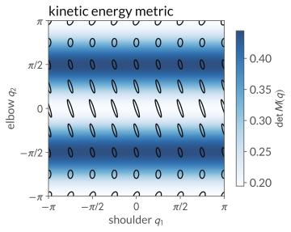
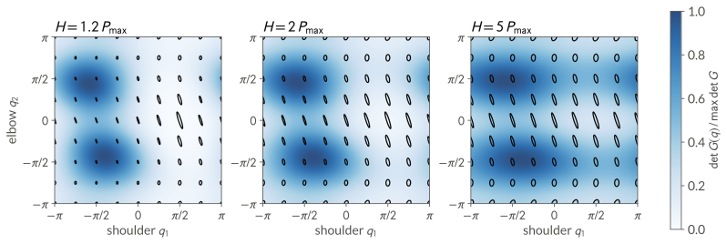
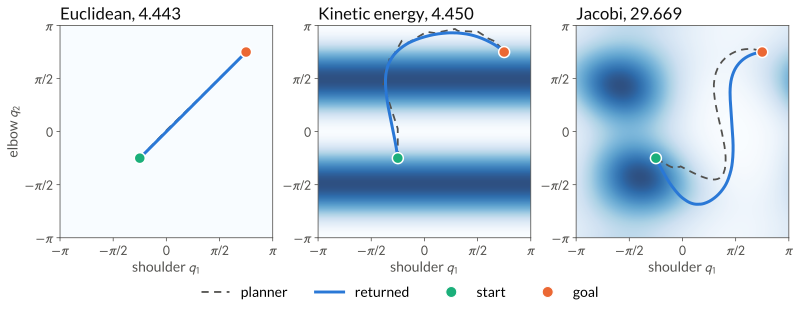

Minimum-Energy Planning on Configuration Manifolds
==================================================

In this tutorial, we plan a two-link planar arm from one configuration to another under three
metrics, the Euclidean metric on the joint angles, the **kinetic-energy metric** and the
**Jacobi metric** :footcite:`kyaw2026geometry,li2024riemannian,jaquier2022riemannian`, and we
compare the three motions.

.. plotly-figure:: minimum-energy-arm
   :alt: A two-link planar arm moving along the Euclidean, kinetic-energy and Jacobi paths.

   The arm along the Euclidean (left), kinetic-energy (center) and Jacobi (right) paths. The
   slider and the play button advance all three by the same fraction of their metric length,
   and the dotted curve traces the hand.

The full script is ``examples/tutorials/minimum_energy_planning.py``, and the C++ version is
``examples/tutorials/minimum_energy_planning.cpp``. Planning needs the Linux or macOS wheel
(see :doc:`/getting-started/installation`).

.. code-pair:: tutorials/minimum_energy_planning setup

1. Define the mass matrix
-------------------------

The arm has two links of length :math:`l_1, l_2` and mass :math:`m_1, m_2`, with their
centers of mass at :math:`l_{c1}, l_{c2}` from the joints and moments of inertia
:math:`I_1, I_2`. The defaults below are uniform rods of 1 m and 1 kg. The mass matrix of the
joint angles :math:`q = (q_1, q_2)` is

.. math::

   M(q) = \begin{pmatrix}
     I_1 + I_2 + m_1 l_{c1}^2 + m_2\bigl(l_1^2 + l_{c2}^2 + 2 l_1 l_{c2} \cos q_2\bigr) &
     I_2 + m_2\bigl(l_{c2}^2 + l_1 l_{c2} \cos q_2\bigr) \\[4pt]
     I_2 + m_2\bigl(l_{c2}^2 + l_1 l_{c2} \cos q_2\bigr) &
     I_2 + m_2 l_{c2}^2
   \end{pmatrix}.

The metrics of geodex take the mass matrix as a callable, a function object in either
language.

.. code-pair:: tutorials/minimum_energy_planning mass-matrix

2. Build the kinetic-energy space
---------------------------------

The kinetic-energy metric measures a joint velocity by :math:`\dot q^\top M(q)\, \dot q`,
twice the kinetic energy of the motion. The configuration space is :math:`\mathbb{R}^2` with
the planner's bounds :math:`[-\pi, \pi]^2` and this metric.

.. code-pair:: tutorials/minimum_energy_planning ke-space

3. Define the potential
-----------------------

The Jacobi metric adds gravity through the potential energy of the two links,

.. math::

   P(q) = m_1 g l_{c1} \sin q_1 + m_2 g \bigl(l_1 \sin q_1 + l_{c2} \sin(q_1+q_2)\bigr).

.. code-pair:: tutorials/minimum_energy_planning potential

4. Build the Jacobi space
-------------------------

For a total energy :math:`H` above the potential everywhere, the Jacobi metric is

.. math::

   \langle u, v \rangle_q = 2\,(H - P(q))\; u^\top M(q)\, v ,

and its geodesics are the motions of the arm under gravity alone at energy :math:`H`
:footcite:`Arnold1989`. The factor :math:`2(H - P(q))` is twice the kinetic energy the arm
has left at :math:`q`. The potential is largest with the arm straight up,
:math:`P_{\max} = g\,(m_1 l_{c1} + m_2(l_1 + l_{c2})) \approx 19.62` J, and we set
:math:`H = 1.2\,P_{\max}`.

.. code-pair:: tutorials/minimum_energy_planning jacobi-space

5. Look at the metrics
----------------------

A metric ellipse at :math:`q` is the unit ball :math:`\{v : \langle v, v \rangle_q \le 1\}`,
the velocities of unit cost. A large ellipse marks a region where motion is cheap.

   Kinetic-energy metric ellipses over :math:`[-\pi, \pi]^2`, drawn on a color map of the
   determinant of :math:`M(q)`.

The kinetic-energy ellipses change with the elbow angle :math:`q_2` alone. Near
:math:`q_2 = 0`, with the arm stretched out, the shoulder swings both links at full radius,
and the ellipses are long and thin, stretched along the elbow direction. Near
:math:`q_2 = \pm\pi`, with the arm folded back, the shoulder's inertia drops and the ellipses
become rounder.

   Jacobi metric ellipses at three energy levels. In each panel, the largest ellipse fills its
   grid cell, and the determinant is divided by its largest value.

At :math:`H = 1.2\,P_{\max}` (left), the factor :math:`2(H - P(q))` varies strongly.
Where the potential is low, the ellipses shrink and motion is expensive. Where
:math:`P(q)` approaches :math:`H`, the ellipses grow and motion is cheap. At
:math:`H = 2\,P_{\max}` (middle) and :math:`H = 5\,P_{\max}` (right), the factor varies
less, and the ellipses take the shapes of the kinetic-energy ellipses.

6. Plan under each metric
-------------------------

We plan the same start and goal once under each metric. G-RRT\* runs with the greedy ratio
at zero and the zero heuristic, as an uninformed RRT\*, and every metric gets the same
search. ``iterations=3000`` and ``seed=1`` give the same paths on every run.

.. code-pair:: tutorials/minimum_energy_planning plan

It prints

.. code-block:: text

   Euclidean       solved=True cost=4.4429 waypoints=2
   Kinetic energy  solved=True cost=4.4500 waypoints=297
   Jacobi          solved=True cost=29.6691 waypoints=452

         metrics.

   The three plans from the start (green) to the goal (orange), over the determinant of each
   metric. The dashed line is the planner's path, with each edge drawn along the curve the
   planner checked, and the blue line is the path that ``plan`` returns. Each title names the
   metric and the length of the returned path under it.

Under the Euclidean metric, the returned path is the straight line in joint space, of length
:math:`\pi\sqrt{2} \approx 4.443`. The kinetic-energy path folds the elbow toward
:math:`q_2 = \pi`, swings the shoulder, and unfolds the elbow at the end. With the elbow folded,
the shoulder's effective inertia :math:`M_{11}(q) = \tfrac{5}{3} + \cos q_2` is smallest. The
path's kinetic-energy length is 4.450, against 5.850 for the straight line.
The Jacobi path swings through configurations where the arm is raised, around
:math:`q_1 = \pi/2`, where the arm has little kinetic energy left and the metric is small. Its
Jacobi length is 29.67, against 33.24 for the straight line. Lengths under different metrics
measure different quantities.

.. note::

   The zero heuristic is admissible for every metric. The default Euclidean chord is not
   admissible under the kinetic-energy metric, whose smallest eigenvalue drops to about 0.07
   with the arm stretched out (:math:`q_2 = 0`), and some paths are shorter than their
   chord.

7. Try it: raise the energy
---------------------------

Plan the Jacobi metric again at :math:`H = 5\,P_{\max}` and compare how far each path folds
the elbow.

.. code-pair:: tutorials/minimum_energy_planning try-it

It prints

.. code-block:: text

   Kinetic energy        largest elbow angle 2.925 rad
   Jacobi, H = 1.2 Pmax  largest elbow angle 2.356 rad
   Jacobi, H = 5 Pmax    largest elbow angle 2.889 rad

At the higher energy, the Jacobi path folds the elbow like the kinetic-energy path, and the
figure of step 5 shows the same trend in the ellipses.

Where to go next
----------------

- :doc:`/concepts/metrics` covers the kinetic-energy and Jacobi metrics and the other metrics
  geodex provides.
- :doc:`/concepts/planning` covers the planner, its settings and admissible heuristics.
- :doc:`/robots/manipulation` plans a Franka FR3 under its kinetic-energy metric.

References
----------

.. footbibliography::
