SE(2) Motion Planning
=====================

This tutorial walks through motion planning in :math:`\mathrm{SE}(2)` for three
increasingly constrained robot types: a holonomic circular robot, a differential-drive
robot with a rectangular footprint, and a car-like vehicle that parks between obstacles.
Along the way we will also go through the geodex collision checking module, polygon footprint
validation, SDF-based clearance metrics, and the full OMPL planning and smoothing
pipeline. By the end you will know how to set up an :math:`\mathrm{SE}(2)` planner
on an occupancy grid or among rectangle obstacles, and how to tune the clearance metric
so planned paths maintain safe distance from walls.

.. note::

   This tutorial assumes you have :doc:`installed geodex </getting-started/index>` with
   OMPL support (see `OMPL installation guide <https://ompl.kavrakilab.org/installation.html>`_)
   and are familiar with the basic geodex operations covered in :doc:`geodex-basics`.
   All the code will be in C++ only since the OMPL adapter layer does not have Python bindings support yet.

Poses and Footprints
--------------------

A pose in :math:`\mathrm{SE}(2) = \mathbb{R}^2 \rtimes \mathrm{SO}(2)` is a triple
:math:`(x, y, \theta)` that encodes a planar position and orientation. In geodex the
:cpp:class:`geodex::SE2` class represents this Lie group, with poses stored as ``Eigen::Vector3d``:

.. code-block:: cpp

   #include <geodex/geodex.hpp>
   #include <geodex/collision/collision.hpp>

   geodex::SE2<> se2;
   Eigen::Vector3d pose{5.0, 3.0, M_PI / 4.0};  // (x, y, theta)

A real robot is not a point. Its physical shape, the **footprint**, is a set of
body-frame points that move rigidly with the pose. Footprint shape is purely
geometric and independent of the kinematic model: a differential-drive or car-like
robot can be approximated by a disc, and a holonomic robot can just as easily
carry a rectangular or polygonal outline. A disc reduces collision to a single point
query against an inflated distance field, while rectangles and convex polygons capture
elongated or asymmetric shapes at the cost of a heading-dependent test.
The figure below shows the three robots at a pose with body-frame axes
:math:`x` (red, forward) and :math:`y` (green, left).

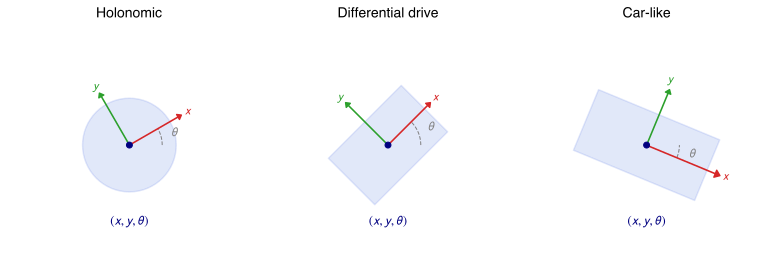

In code, a circular footprint is captured by its radius alone; the collision
checking module uses this radius to inflate the obstacle distance field.
Non-circular shapes use :cpp:class:`geodex::collision::PolygonFootprint`, which stores body-frame
perimeter samples of a convex polygon.
Both the ``rectangle`` factory and the general constructor take a ``samples_per_edge``
argument that sets how many uniformly-spaced points are placed along each edge:

.. code-block:: cpp

   // Circular footprint: a single radius. Collision reduces to a point query
   // against an obstacle distance field inflated by this value.
   constexpr double robot_radius = 0.3;

   // Rectangular footprint via the factory.
   auto rect_fp = geodex::collision::PolygonFootprint::rectangle(
       /*half_length=*/0.35, /*half_width=*/0.25, /*samples_per_edge=*/6);

   // Arbitrary convex polygon from ordered body-frame vertices (counter-clockwise).
   std::vector<Eigen::Vector2d> verts = {
       {-0.35, -0.30},  // rear-right
       { 0.35, -0.20},  // front-right
       { 0.35,  0.20},  // front-left
       {-0.35,  0.30},  // rear-left
   };
   geodex::collision::PolygonFootprint poly_fp(verts, /*samples_per_edge=*/4);

More samples give tighter collision detection at a small runtime cost; four to six
per edge works well for most robot footprints at centimeter-scale grid resolutions.

Left-Invariant Metrics on SE(2)
^^^^^^^^^^^^^^^^^^^^^^^^^^^^^^^

The choice of Riemannian metric determines what "shortest path" means.
:cpp:class:`geodex::SE2LeftInvariantMetric` defines a diagonal inner product on
:math:`\mathrm{SE}(2)`:

.. math::

   \langle u, v \rangle_q = w_x\, u_x v_x + w_y\, u_y v_y + w_\theta\, u_\theta v_\theta

where :math:`w_x, w_y, w_\theta > 0` are positive weights.
By adjusting these weights, we can create different motion preferences and kinematic models:

.. list-table::
   :header-rows: 1
   :widths: 12 12 12 48 22

   * - :math:`w_x`
     - :math:`w_y`
     - :math:`w_\theta`
     - Behavior
     - Kinematic model
   * - 1.0
     - 1.0
     - 0.5
     - Isotropic translation, cheap rotation
     - Holonomic
   * - 1.0
     - 10.0
     - 1.0
     - Penalizes lateral sliding
     - Differential drive
   * - 1.0
     - 20.0
     - 2.25
     - With effective turning radius 1.5 m
     - Car-like

.. code-block:: cpp

   // Holonomic: isotropic translation.
   geodex::SE2LeftInvariantMetric metric_holo{1.0, 1.0, 0.5};

   // Differential drive: moderate lateral penalty.
   geodex::SE2LeftInvariantMetric metric_diff{1.0, 10.0, 1.0};

   // Car-like: effective turning radius of 1.5 m, lateral penalty 20.
   auto metric_car = geodex::SE2LeftInvariantMetric::car_like(
       /*turning_radius=*/1.5, /*lateral_penalty=*/20.0);

The convenience factory ``car_like(turning_radius, lateral_penalty)`` sets
:math:`w_\theta = \text{turning\_radius}^2` and :math:`w_y = \text{lateral\_penalty}`,
so that the geodesic turning radius is approximately
:math:`r_\text{eff} \approx \sqrt{w_\theta / w_x}` and a large ``lateral_penalty``
strongly discourages sideslip. This is a soft constraint: the metric penalizes
tight turns but does not forbid them.

Preparing the Environment
-------------------------

Occupancy Maps and Distance Grids
^^^^^^^^^^^^^^^^^^^^^^^^^^^^^^^^^^

Many indoor environments are described by an occupancy grid: a raster image where dark
pixels represent walls and light pixels represent free space. Before we can plan, we
convert this image into a **distance grid**, a precomputed Euclidean distance transform
that stores the signed distance to the nearest obstacle at every cell. The C++ class
:cpp:class:`geodex::collision::DistanceGrid` loads and queries this grid with bilinear
interpolation.

The Willow Garage map (1222 x 966 pixels at 0.05 m/pixel) is large enough that a small
robot becomes hard to see. For this tutorial we crop it into a smaller section of approximately
18 x 12 m, which provides narrow hallways and corners that make collision checking and
clearance metrics visually interesting:

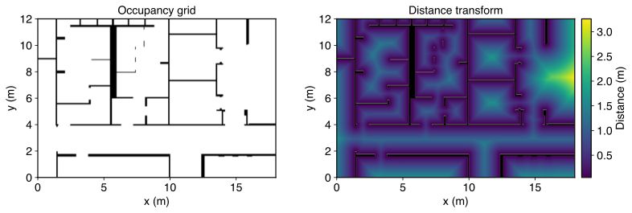

   A smaller section cropped from the Willow Garage map. Left: the occupancy grid.
   Right: the Euclidean distance transform over the free space, with walls shown
   in black; lighter colors indicate higher clearance.

In C++, loading the distance grid is a single call:

.. code-block:: cpp

   geodex::collision::DistanceGrid grid;
   grid.load("willow_corridor_dist.txt");

   // World dimensions in meters.
   double world_w = grid.width() * grid.resolution();
   double world_h = grid.height() * grid.resolution();

Synthetic Parking Lot
^^^^^^^^^^^^^^^^^^^^^

For the car-like parking scenario we define obstacles directly in code as oriented
rectangles (:cpp:class:`geodex::collision::RectObstacle`). Four parked cars line the
curb with a gap in the middle for the ego vehicle:

.. code-block:: cpp

   using RectObstacle = geodex::collision::RectObstacle;
   constexpr double car_hl = 2.25, car_hw = 0.9;  // 4.5 x 1.8 m

   std::vector<RectObstacle> obstacles = {
       {5.0, 1.35, 0.0, car_hl, car_hw},   // parked car 1
       {10.0, 1.35, 0.0, car_hl, car_hw},  // parked car 2
       {21.0, 1.35, 0.0, car_hl, car_hw},  // parked car 3
       {26.0, 1.35, 0.0, car_hl, car_hw},  // parked car 4
       {15.0, -0.05, 0.0, 15.0, 0.05},     // curb
       {15.0, 10.05, 0.0, 15.0, 0.05},     // sidewalk
   };

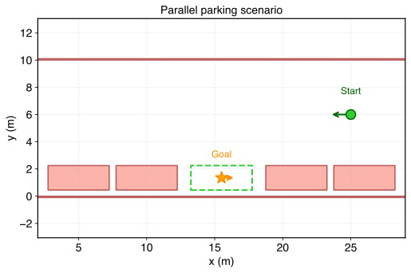

   The parallel parking scenario. Parked vehicles (salmon) create a gap between cars
   2 and 3. The ego vehicle approaches from the right (green) and must park in the gap
   (orange star).

Holonomic Circular Robot
------------------------

The simplest case is a holonomic robot with a circular footprint of radius :math:`r`.
It can translate in any direction and rotate freely, so we use the isotropic metric
``SE2LeftInvariantMetric{1.0, 1.0, 1.0}``.

Collision Checking for a Disc
^^^^^^^^^^^^^^^^^^^^^^^^^^^^^

For a circular robot, collision checking reduces to a point query: the robot is
collision-free if and only if the signed distance at its center exceeds the robot
radius plus a small safety buffer. A bilinear-interpolated
``DistanceGrid::distance_at`` query is enough:

.. code-block:: cpp

   constexpr double robot_radius = 0.3;
   constexpr double safety_margin = 0.10;  // extra buffer beyond the robot radius

   auto is_valid = [&grid, robot_radius](const Eigen::Vector3d& q) {
       return grid.distance_at(q[0], q[1]) > robot_radius + safety_margin;
   };

For the clearance metric later in this tutorial we will also want a continuous
signed distance field that already accounts for the robot radius. That is what
:cpp:class:`geodex::collision::GridSDF` and :cpp:class:`geodex::collision::InflatedSDF`
provide: ``GridSDF`` wraps the distance grid as a callable, and ``InflatedSDF``
subtracts the robot radius so its output is positive exactly when the disc fits.

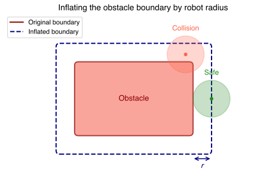

   Inflating the obstacle by the robot radius :math:`r`. The original boundary
   (solid) becomes the inflated boundary (dashed). A circular robot whose center lies
   outside the dashed line is guaranteed to be collision-free.

Setting Up the Planner
^^^^^^^^^^^^^^^^^^^^^^

The OMPL pipeline begins with wrapping our geodex manifold as an OMPL state space.
:cpp:class:`geodex::integration::ompl::GeodexStateSpace` handles this automatically:
it delegates distance, interpolation, and sampling to the underlying manifold. The
validity checker and optimization objective complete the setup:

.. code-block:: cpp

   namespace ob = ompl::base;
   namespace og = ompl::geometric;

   // 1. Create manifold and state space.
   geodex::SE2LeftInvariantMetric metric{1.0, 1.0, 1.0};
   geodex::SE2<> manifold{metric, geodex::SE2ExponentialMap{},
                          Eigen::Vector3d(0, 0, -M_PI),
                          Eigen::Vector3d(world_w, world_h, M_PI)};

   ob::RealVectorBounds bounds(3);
   bounds.setLow(0, 0.0);   bounds.setHigh(0, world_w);
   bounds.setLow(1, 0.0);   bounds.setHigh(1, world_h);
   bounds.setLow(2, -M_PI); bounds.setHigh(2, M_PI);

   auto space = std::make_shared<GeodexStateSpace<decltype(manifold)>>(manifold, bounds);
   space->setCollisionResolution(grid.resolution());

   // 2. SimpleSetup with validity checker.
   og::SimpleSetup ss(space);
   ss.setStateValidityChecker(
       make_validity_checker<decltype(manifold)>(
           ss.getSpaceInformation(), is_valid));

   // 3. Start and goal.
   using SS = geodex::integration::ompl::GeodexStateSpace<decltype(manifold)>;
   ob::ScopedState<SS> start(space), goal(space);
   start->values[0] = 2.0;  start->values[1] = 5.0;  start->values[2] = 0.0;
   goal->values[0] = 12.0;  goal->values[1] = 6.0;   goal->values[2] = -M_PI/2;
   ss.setStartAndGoalStates(start, goal, 0.5);

   // 4. Optimization objective.
   Eigen::Vector3d goal_coords{12.0, 6.0, -M_PI/2};
   auto objective = std::make_shared<
       GeodexOptimizationObjective<decltype(manifold)>>(
           ss.getSpaceInformation(), goal_coords);
   ss.setOptimizationObjective(objective);

   // 5. Plan with Informed RRT*.
   ss.setPlanner(std::make_shared<og::InformedRRTstar>(ss.getSpaceInformation()));
   ss.solve(0.5);

Path Smoothing
^^^^^^^^^^^^^^

The raw RRT* solution is piecewise-geodesic with unnecessary detours. The
``smooth_path`` function refines it in two phases: random shortcutting removes
redundant waypoints, then L-BFGS energy minimization pulls the remaining path
toward the metric geodesic while respecting collision constraints:

.. code-block:: cpp

   // Extract waypoints from the OMPL solution path.
   auto& solution = ss.getSolutionPath();
   std::vector<Eigen::Vector3d> waypoints;
   for (const auto* state : solution.getStates()) {
       const auto* s = state->as<SS::StateType>();
       waypoints.push_back({s->values[0], s->values[1], s->values[2]});
   }

   auto result = geodex::algorithm::smooth_path(manifold, is_valid, waypoints);

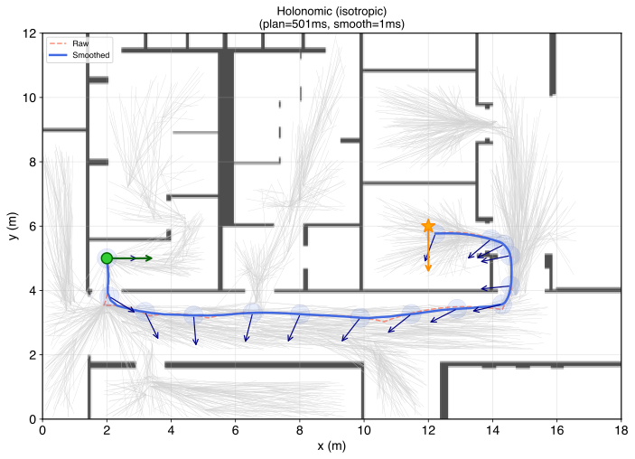

   Planning result under the isotropic metric. The RRT* tree (gray),
   raw path (dashed red), and smoothed path (solid blue) are shown with
   circular footprints drawn at intervals along the smoothed trajectory.

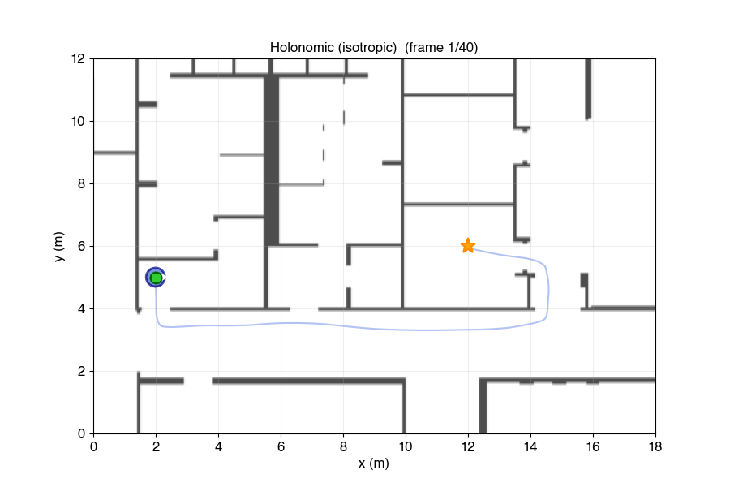

   The circular robot following the smoothed path through the corridor.

Reproducing the figures:

.. toggle::

   .. code-block:: sh

      cmake -B build -DBUILD_OMPL_EXAMPLES=ON -Dompl_DIR=/path/to/ompl
      cmake --build build --target se2_tutorial

      DIST=examples/ompl/willow_corridor_dist.txt
      ./build/examples/ompl/se2_tutorial $DIST \
          --scenario=holonomic -o se2_tutorial_holonomic.json --time=0.5 --seed=1

      python scripts/visualize_se2_tutorial.py \
          se2_tutorial_holonomic.json \
          -o docs/tutorials/figs/se2-planning/holonomic_result.svg \
          --map examples/ompl/willow_corridor.png

      python scripts/animate_se2_tutorial.py \
          se2_tutorial_holonomic.json \
          -o docs/tutorials/figs/se2-planning/holonomic_sweep.gif \
          --map examples/ompl/willow_corridor.png

Differential-Drive Robot
------------------------

A differential-drive robot has two independently driven wheels. It can move forward,
backward, and rotate in place, but it cannot slide sideways without rotating first.
This kinematic constraint is captured by an anisotropic metric that penalizes lateral
motion, independently of footprint shape. We also switch to a rectangular footprint
for this scenario to illustrate orientation-dependent collision checking, though the
same metric applies just as well to a circular chassis.

Polygon Footprint Collision Checking
^^^^^^^^^^^^^^^^^^^^^^^^^^^^^^^^^^^^^

For a non-circular robot the inflated SDF trick no longer works: whether the robot
collides or not now depends on both its position and its heading. The geodex collision module
provides :cpp:class:`geodex::collision::PolygonFootprint` and
:cpp:class:`geodex::collision::FootprintGridChecker` for this purpose.

``PolygonFootprint`` precomputes a set of body-frame **perimeter samples** around the
robot outline. At query time, ``FootprintGridChecker`` transforms all samples to world
coordinates (using a single ``sincos`` call shared across all points), batch-queries the
distance grid with SIMD-accelerated bilinear interpolation, and returns the minimum
signed distance across all samples. If this minimum is positive, the entire footprint is
collision-free:

.. code-block:: cpp

   auto footprint = geodex::collision::PolygonFootprint::rectangle(
       /*half_length=*/0.35, /*half_width=*/0.25, /*samples_per_edge=*/6);

   geodex::collision::FootprintGridChecker checker{&grid, footprint, /*safety_margin=*/0.10};

   auto is_valid = [&checker](const auto& q) {
       return checker.is_valid(q);
   };

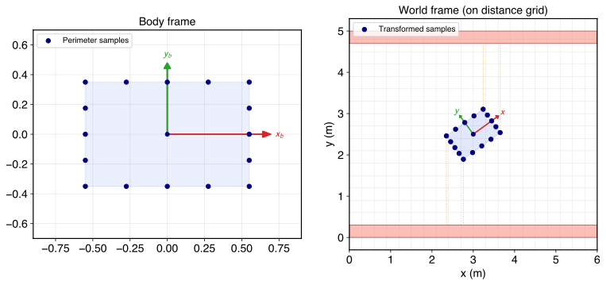

   Left: body-frame perimeter samples around the rectangular footprint. Right: the
   samples transformed to world frame and checked against the distance grid. Orange
   dotted lines show the distance query from each sample to the nearest wall.

Anisotropic Metric for Differential Drive
^^^^^^^^^^^^^^^^^^^^^^^^^^^^^^^^^^^^^^^^^^

A differential-drive robot prefers forward and backward motion over lateral sliding. We
express this by setting :math:`w_y > w_x` in the left-invariant metric, which makes
lateral motion "expensive" in the Riemannian sense. The planner then naturally produces
paths with forward-facing arcs and in-place rotations at turns rather than diagonal
sliding motions:

.. code-block:: cpp

   geodex::SE2LeftInvariantMetric metric{1.0, 10.0, 1.0};
   geodex::SE2<> manifold{metric, geodex::SE2ExponentialMap{},
                          Eigen::Vector3d(0, 0, -M_PI),
                          Eigen::Vector3d(world_w, world_h, M_PI)};

The planner setup is identical to the holonomic case, substituting this manifold and the
footprint-based validity checker for the inflated SDF one.

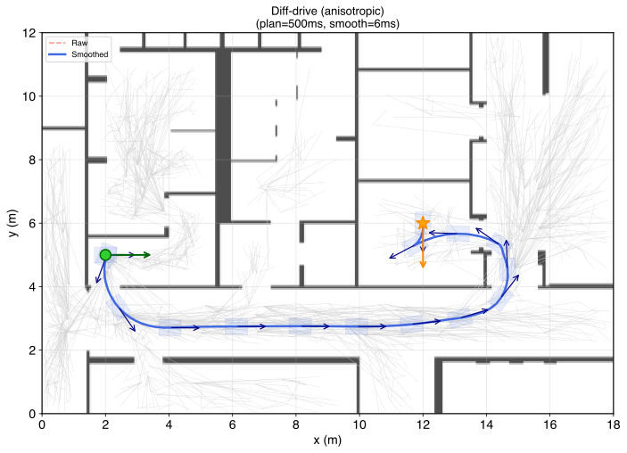

   A differential-drive robot navigating the corridor. The anisotropic metric produces
   paths with clear forward-facing motion and rotation at waypoints.

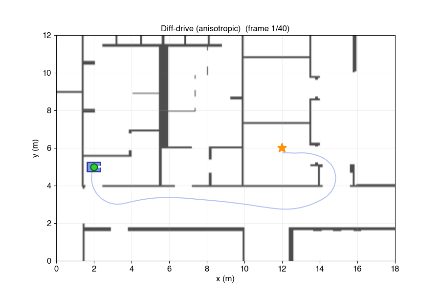

   A differential-drive robot under (anisotropic) left-invariant Riemannian metric.

Reproducing the figures:

.. toggle::

   .. code-block:: sh

      ./build/examples/ompl/se2_tutorial $DIST \
          --scenario=diff_drive -o se2_tutorial_diff_drive.json --time=0.5 --seed=1

      python scripts/visualize_se2_tutorial.py \
          se2_tutorial_diff_drive.json \
          -o docs/tutorials/figs/se2-planning/diff_drive_result.svg \
          --map examples/ompl/willow_corridor.png

      python scripts/animate_se2_tutorial.py \
          se2_tutorial_diff_drive.json \
          -o docs/tutorials/figs/se2-planning/diff_drive_sweep.gif \
          --map examples/ompl/willow_corridor.png

Clearance-Aware Planning
------------------------

The paths produced so far are geometrically shortest under the chosen metric, but they
may brush close to walls. A real robot needs clearance: it should prefer routes through
the middle of a corridor even if they are slightly longer. The geodex
**conformal clearance metric** achieves this by warping the Riemannian geometry near
obstacles.

The Conformal Clearance Metric
^^^^^^^^^^^^^^^^^^^^^^^^^^^^^^

:cpp:class:`geodex::SDFConformalMetric` wraps any base metric and conformally scales it
by a factor that grows near obstacles:

.. math::

   c(q) = 1 + \kappa \exp\bigl(-\beta \cdot \mathrm{sdf}(q)\bigr)

where :math:`\mathrm{sdf}(q)` is the signed distance from the robot to the nearest
obstacle (positive in free space), :math:`\kappa` controls the strength of the
repulsion, and :math:`\beta` controls the falloff rate. The inner product becomes

.. math::

   \langle u, v \rangle_q^{\text{clear}} = c(q) \cdot \langle u, v \rangle_q^{\text{base}}

so that paths near obstacles become "longer" in the metric sense. The planner, which
minimizes path cost, naturally routes through regions where :math:`c(q) \approx 1`
(high clearance).

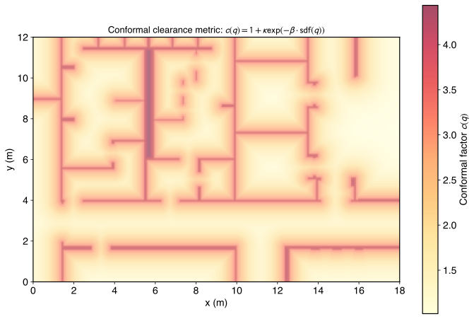

   The conformal factor :math:`c(q)` overlaid on the corridor map with
   :math:`\kappa = 1.5` and :math:`\beta = 1.5`. Warm colors near walls indicate
   high metric cost; cool regions in the corridor center have
   :math:`c(q) \approx 1`.

To apply the clearance metric we create a
:cpp:class:`geodex::ConfigurationSpace` that overlays the clearance-weighted metric on
the base :math:`\mathrm{SE}(2)` topology. The base manifold provides the exponential
and logarithmic maps, while the custom metric provides all geometry (inner product,
norm, distance):

.. code-block:: cpp

   // Base metric and SDF (inflated by robot radius for a circular robot).
   geodex::SE2LeftInvariantMetric base_metric{1.0, 1.0, 1.0};
   geodex::collision::InflatedSDF inflated_sdf{
       geodex::collision::GridSDF{&grid}, 0.3};

   // Conformal clearance metric: kappa=1.5, beta=1.5.
   geodex::SDFConformalMetric clearance_metric{
       base_metric, inflated_sdf, 1.5, 1.5};

   // Compose: SE(2) topology + clearance geometry.
   geodex::SE2<> se2{base_metric, geodex::SE2ExponentialMap{},
                     Eigen::Vector3d(0, 0, -M_PI),
                     Eigen::Vector3d(world_w, world_h, M_PI)};
   geodex::ConfigurationSpace cspace{se2, clearance_metric};

The ``cspace`` object satisfies the ``RiemannianManifold`` concept and can be passed
to ``GeodexStateSpace``, ``smooth_path``, and any other geodex algorithm.

With vs Without Clearance
^^^^^^^^^^^^^^^^^^^^^^^^^

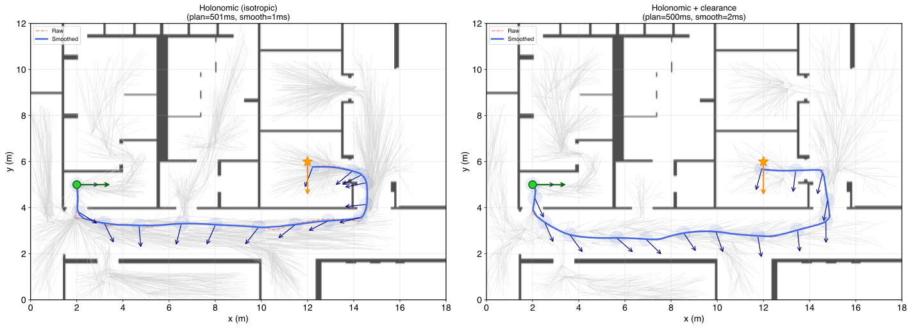

   Holonomic robot in the corridor. Left: baseline isotropic metric (the path cuts
   close to walls). Right: clearance metric with :math:`\kappa=1.5, \beta=1.5`
   (the path maintains safe distance from walls throughout).

Clearance for the Differential-Drive Robot
^^^^^^^^^^^^^^^^^^^^^^^^^^^^^^^^^^^^^^^^^^

An appealing property of ``FootprintGridChecker`` is that its ``operator()`` returns a
continuous signed distance (the minimum grid distance across all perimeter samples minus
the safety margin), not just a binary collision result. This makes it directly usable as
the SDF input to ``SDFConformalMetric``. The same object serves double duty: binary
validity checking for the planner, and continuous clearance field for the metric:

.. code-block:: cpp

   auto footprint = geodex::collision::PolygonFootprint::rectangle(0.35, 0.25, 6);
   geodex::collision::FootprintGridChecker checker{&grid, footprint, 0.05};

   // Binary validity for the planner.
   auto is_valid = [&checker](const auto& q) { return checker.is_valid(q); };

   // Continuous SDF for the clearance metric (same object).
   geodex::SE2LeftInvariantMetric base_metric{1.0, 10.0, 1.0};
   geodex::SDFConformalMetric clearance_metric{base_metric, checker, 1.5, 1.5};

   geodex::SE2<> se2{base_metric, geodex::SE2ExponentialMap{},
                     Eigen::Vector3d(0, 0, -M_PI),
                     Eigen::Vector3d(world_w, world_h, M_PI)};
   geodex::ConfigurationSpace cspace{se2, clearance_metric};

   A Differential-drive robot under the clearance metric. The combined effect of
   anisotropic weights (preferring forward motion) and conformal scaling (avoiding
   walls) produces paths that track the corridor center with smooth forward-facing arcs.

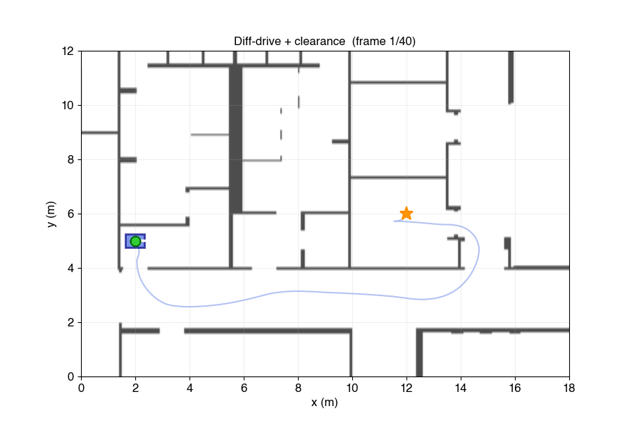

   A Differential-drive robot following the smoothed path with the clearance metric active.

Reproducing the figures:

.. toggle::

   .. code-block:: sh

      ./build/examples/ompl/se2_tutorial $DIST \
          --scenario=holo_clearance -o se2_tutorial_holo_clearance.json --time=0.5 --seed=1
      ./build/examples/ompl/se2_tutorial $DIST \
          --scenario=diff_clearance -o se2_tutorial_diff_clearance.json --time=0.5 --seed=1

      FIGS=docs/tutorials/figs/se2-planning
      MAP=examples/ompl/willow_corridor.png

      python scripts/visualize_se2_tutorial.py \
          se2_tutorial_holo_clearance.json \
          -o $FIGS/conformal_factor.svg --map $MAP --mode conformal

      python scripts/visualize_se2_tutorial.py \
          se2_tutorial_holonomic.json se2_tutorial_holo_clearance.json \
          -o $FIGS/clearance_comparison.svg --map $MAP --mode comparison

      python scripts/visualize_se2_tutorial.py \
          se2_tutorial_diff_clearance.json \
          -o $FIGS/diff_clearance_result.svg --map $MAP

      python scripts/animate_se2_tutorial.py \
          se2_tutorial_diff_clearance.json \
          -o $FIGS/diff_clearance_sweep.gif --map $MAP

Car-Like Robot in a Parking Lot
-------------------------------

The most constrained robot type is a car-like vehicle with an effective minimum turning
radius and no lateral motion. We use the synthetic parking lot defined earlier and plan a
parallel parking maneuver.

The Car-Like Metric
^^^^^^^^^^^^^^^^^^^

The ``car_like(r, lp)`` factory creates metric weights that produce geodesics with an
effective turning radius of approximately :math:`r`. A moderate lateral penalty
(:math:`w_y = 20`) strongly discourages sideslip while keeping the metric landscape
tractable for an RRT\* tree, so the planner produces smooth arcs rather than
diagonal motions:

.. code-block:: cpp

   auto metric = geodex::SE2LeftInvariantMetric::car_like(1.5, 20.0);
   // Weights: wx=1.0, wy=20.0, w_theta=2.25 (= 1.5^2)

Note that this is a soft constraint. Near the start and goal, the optimizer may produce
short segments of in-place rotation where a real Ackermann vehicle would need a
multi-point turn.

Rectangle Obstacles and RectSmoothSDF
^^^^^^^^^^^^^^^^^^^^^^^^^^^^^^^^^^^^^

The parking scenario uses :cpp:class:`geodex::collision::RectSmoothSDF` to compute a
smooth signed distance field over the oriented rectangle obstacles. Like
``CircleSmoothSDF``, it uses log-sum-exp to produce a differentiable approximation to
the min-distance, but with SIMD-accelerated rectangle SDF evaluation internally:

.. code-block:: cpp

   geodex::collision::RectSmoothSDF sdf{obstacles, 20.0, car_hw};
   // beta=20 (smoothness), inflation=car_hw (half-width of ego vehicle)

The ``inflation`` parameter performs Minkowski expansion: it subtracts the ego vehicle's
half-width from all obstacle distances inside the SIMD loop, effectively growing
obstacles by the robot's lateral extent. This gives the clearance metric an
inflation-aware SDF without requiring a separate wrapper.

For the binary validity check we use the exact separating-axis-theorem (SAT) test
:cpp:func:`geodex::collision::rects_overlap`, which checks whether the ego vehicle's
oriented bounding box overlaps any obstacle:

.. code-block:: cpp

   auto is_valid = [&](const auto& q) {
       RectObstacle ego{q[0], q[1], q[2], car_hl, car_hw};
       for (const auto& obs : obstacles) {
           if (geodex::collision::rects_overlap(ego, obs)) return false;
       }
       return true;
   };

Full Parking Pipeline
^^^^^^^^^^^^^^^^^^^^^

Putting it all together: the car-like metric is wrapped with ``SDFConformalMetric`` for
clearance-aware planning, and the composite
``ConfigurationSpace`` is passed to the OMPL planner. Higher :math:`\kappa` values
(we use 8.0 here) keep the vehicle further from parked cars during the approach:

.. code-block:: cpp

   auto base_metric = geodex::SE2LeftInvariantMetric::car_like(1.5, 20.0);
   geodex::collision::RectSmoothSDF sdf{obstacles, 20.0, car_hw};
   geodex::SDFConformalMetric clearance_metric{base_metric, sdf, 8.0, 3.0};

   geodex::SE2<geodex::SE2LeftInvariantMetric, geodex::SE2ExponentialMap> se2{
       geodex::SE2LeftInvariantMetric::car_like(1.5, 20.0),
       geodex::SE2ExponentialMap{},
       Eigen::Vector3d(0, 0, -M_PI),
       Eigen::Vector3d(30.0, 12.0, M_PI)};
   geodex::ConfigurationSpace cspace{se2, clearance_metric};

   // Smoothing with tighter interpolation for car-like metric.
   geodex::algorithm::PathSmoothingSettings car_smooth;
   car_smooth.interp.step_size = 0.02;
   car_smooth.interp.max_steps = 2000;
   car_smooth.collision_resolution = 0.1;

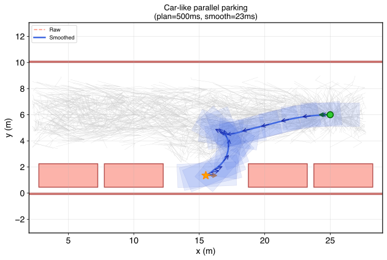

   Parallel parking with the car-like metric. The vehicle approaches from the right and
   executes a reverse maneuver to park between vehicles. Rectangular
   footprints at intervals show the pose progression.

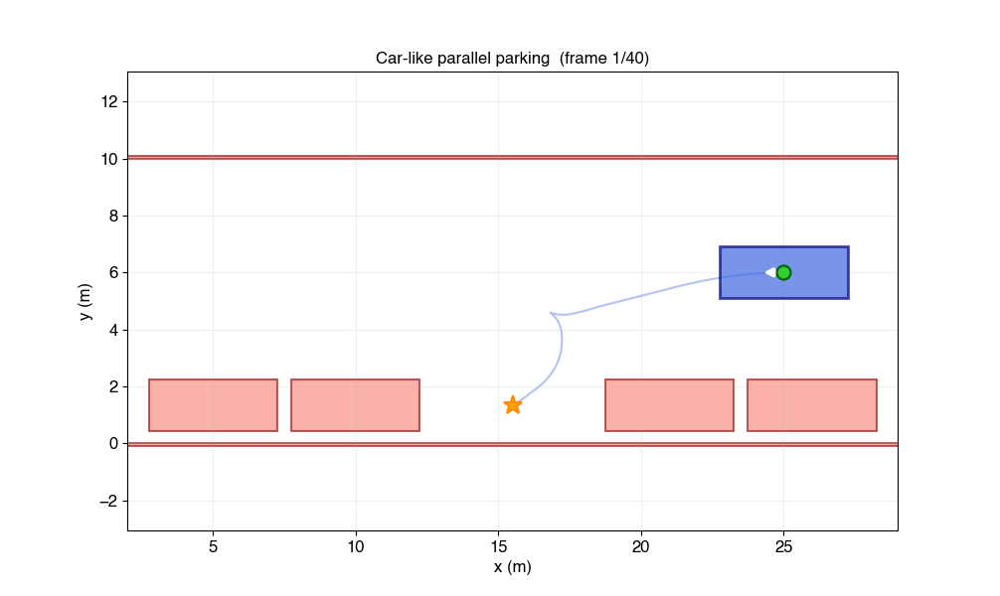

   Animated footprint sweep along the parking path.

Reproducing the figures:

.. toggle::

   .. code-block:: sh

      ./build/examples/ompl/se2_tutorial dummy \
          --scenario=parking -o se2_tutorial_parking.json --time=0.5 --seed=1

      python scripts/visualize_se2_tutorial.py \
          se2_tutorial_parking.json \
          -o docs/tutorials/figs/se2-planning/parking_result.svg

      python scripts/visualize_se2_tutorial.py \
          se2_tutorial_parking.json \
          -o docs/tutorials/figs/se2-planning/parking_lot.svg --mode env

      python scripts/animate_se2_tutorial.py \
          se2_tutorial_parking.json \
          -o docs/tutorials/figs/se2-planning/parking_footprints.gif --fps 15

Summary
-------

This tutorial covered the full SE(2) planning pipeline in geodex with three robot types,
progressively adding complexity at each stage:

.. list-table::
   :header-rows: 1
   :class: scroll-table

   * - Metric
     - Robot
     - Collision
     - Clearance SDF
     - Env
   * - Isotropic (1, 1, 1)
     - Holonomic (circle)
     - ``InflatedSDF``
     - ``InflatedSDF``
     - Willow corridor
   * - Anisotropic (1, 10, 1)
     - Diff-drive (rect)
     - ``FootprintGridChecker``
     - ``FootprintGridChecker``
     - Willow corridor
   * - ``car_like(1.5, 20)``
     - Car-like (rect)
     - SAT ``rects_overlap``
     - ``RectSmoothSDF``
     - Parking lot

See also
^^^^^^^^

- :doc:`geodex-basics` for an introduction to manifolds, metrics, and geodesics
- :doc:`minimum-energy-planning` for planning with configuration-dependent metrics
- The :doc:`/api/index` for full documentation of the collision module and OMPL adapters

