SE(2) Motion Planning
=====================

In this tutorial, we plan motions in :math:`\mathrm{SE}(2)` for three robots, a holonomic disc
robot, a differential-drive robot with a rectangular footprint in an office corridor, and
a car that parks between two parked cars. We also check footprints against a distance grid
and keep the robots away from walls with a clearance metric.

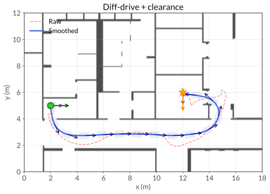

   The differential-drive robot under the clearance metric, the result of step 6. The
   planner's path is dashed, the returned path solid, with footprints along it.

The full script is ``examples/tutorials/se2_planning.py``, and the C++ version is
``examples/tutorials/se2_planning.cpp``. Run it from ``examples/tutorials``, where the corridor
map lives. Planning needs the Linux or macOS wheel (see
:doc:`/getting-started/installation`).

1. Describe poses and footprints
--------------------------------

A pose in :math:`\mathrm{SE}(2)` is a triple :math:`(x, y, \theta)`, a planar position and a
heading.

.. code-pair:: tutorials/se2_planning pose

A robot's **footprint** is its outline, a set of body-frame points that move rigidly with
the pose. A disc needs only its radius. :cpp:class:`geodex::collision::PolygonFootprint`
stores sample points along the edges of a convex polygon, ``samples_per_edge`` per edge.

.. code-pair:: tutorials/se2_planning footprints

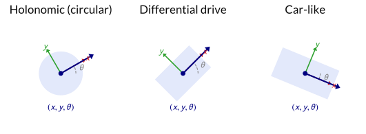

   The three robots at a pose, with the body axes :math:`x` (red, forward) and :math:`y`
   (green, left).

Four to six samples per edge suit most footprints on a centimeter-scale grid.

2. Choose a metric
------------------

:cpp:class:`geodex::SE2LeftInvariantMetric` weighs the forward, sideways and turning speeds
of the robot,

.. math::

   \langle u, v \rangle_q = w_x\, u_x v_x + w_y\, u_y v_y + w_\theta\, u_\theta v_\theta ,

and a weight :math:`w` makes a unit of that motion cost :math:`\sqrt{w}`.

.. list-table::
   :header-rows: 1
   :widths: 12 12 12 42 22

   * - :math:`w_x`
     - :math:`w_y`
     - :math:`w_\theta`
     - Effect
     - Robot
   * - 1.0
     - 1.0
     - 1.0
     - Every direction and turning cost the same
     - Holonomic
   * - 1.0
     - 10.0
     - 1.0
     - A meter of sliding costs about 3.2 meters of driving
     - Differential drive
   * - 1.0
     - 20.0
     - 2.25
     - Turning traded against driving at a radius of 1.5 m
     - Car-like

.. code-pair:: tutorials/se2_planning metrics

``car_like(turning_radius, lateral_penalty)`` sets :math:`w_\theta = r^2` for the turning
radius :math:`r` and :math:`w_y` to the lateral penalty. With :math:`w_x = 1`, turning on the
spot through an angle :math:`\varphi` costs :math:`r \varphi`, as much as driving
:math:`r \varphi` straight ahead. The metric makes tight turns and sideslip expensive and
does not forbid them.

3. Load the corridor map
------------------------

A **distance grid** stores the signed distance to the nearest obstacle at every cell of an
occupancy map, and :cpp:class:`geodex::collision::DistanceGrid` loads and queries it with
bilinear interpolation. The corridor is an 18 m by 12 m section of the Willow Garage map at
0.05 m per cell.

.. code-pair:: tutorials/se2_planning grid

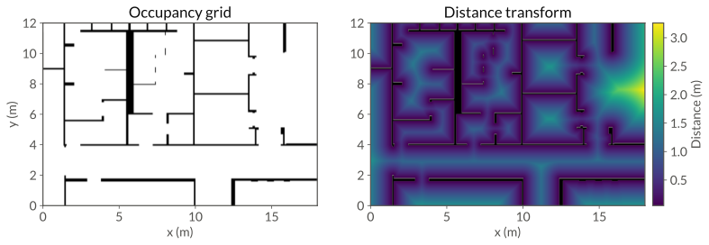

   The corridor. Left, the occupancy grid. Right, the distance transform over the free
   space, with walls in black and lighter colors for higher clearance.

4. Plan for a disc robot
------------------------

A disc of radius :math:`r` is collision-free when the distance at its center exceeds
:math:`r`. The check below asks for a safety buffer of 10 cm on top.

.. code-pair:: tutorials/se2_planning disc-validity

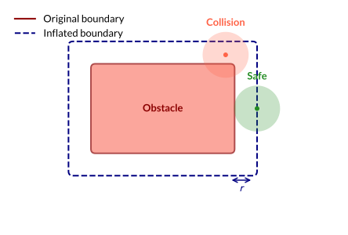

   Inflating an obstacle by the robot radius :math:`r`. A disc whose center lies outside
   the dashed line is collision-free.

``plan`` wraps the manifold as an OMPL state space, runs G-RRT\*, and smooths the result.
``iterations=6000`` and ``seed=1`` give the same path on every run.

.. code-pair:: tutorials/se2_planning holonomic-plan

It prints ``holonomic: solved=True cost=18.399``, the length of the path under the metric.

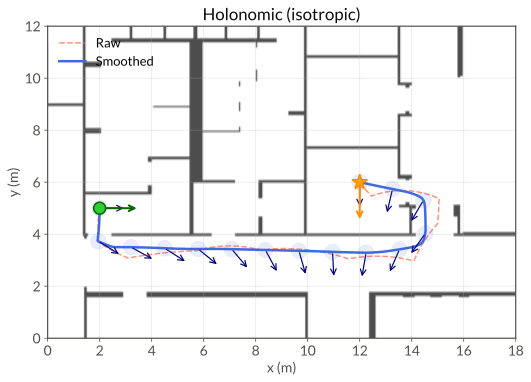

   The holonomic plan. The planner's path is dashed, the returned path solid, with the disc
   drawn along it.

.. video-figure:: se2-holonomic-sweep
   :width: 60%
   :alt: Animated holonomic robot sweep

   The disc robot following the returned path.

A robot that must answer in time sets a ``time`` budget in seconds instead, and leaves
``iterations`` at 0. The path can then change from run to run (see
:doc:`/getting-started/reproducibility`).

.. code-pair:: tutorials/se2_planning time-budget

5. Plan for a differential-drive robot
--------------------------------------

Whether a rectangle collides depends on its position and its heading.
:cpp:class:`geodex::collision::FootprintGridChecker` moves the footprint's samples to the
pose, reads the distance grid at each, and returns the smallest distance minus the safety
margin. A pose is valid when every sample is clear. The spacing of the samples and the
margin decide how close an obstacle can come between two samples.

.. code-pair:: tutorials/se2_planning footprint-checker

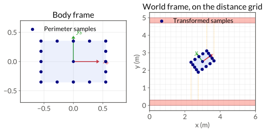

   Left, the perimeter samples in the body frame. Right, the samples at a pose on the
   distance grid, with the distance query from some of them to the nearest wall.

The differential-drive metric makes sliding expensive.

.. code-pair:: tutorials/se2_planning diff-manifold

The metric charges driving backward as much as driving forward.
:cpp:class:`geodex::integration::ompl::DirectionalMotionValidator` rejects any tree edge
whose body-forward component, the first entry of the SE(2) logarithm, is below minus the
reverse budget, -0.5 m here.

.. code-pair:: tutorials/se2_planning directional

It prints ``differential drive: solved=True cost=22.292``.

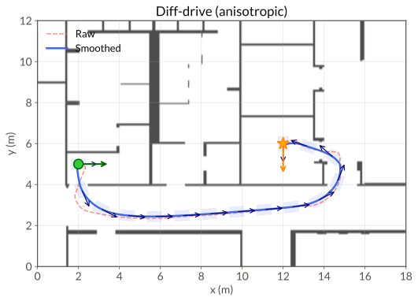

   The differential-drive robot in the corridor, driving forward along arcs.

.. video-figure:: se2-diff-drive-sweep
   :width: 60%
   :alt: Animated differential-drive robot sweep

   The differential-drive robot following the returned path.

6. Keep away from walls
-----------------------

The **clearance metric** (:cpp:class:`geodex::SDFConformalMetric`,
:py:class:`geodex.ClearanceMetric` in Python) scales a base metric by a factor that grows
near obstacles,

.. math::

   c(q) = 1 + \kappa \exp\bigl(-\beta \cdot \mathrm{sdf}(q)\bigr), \qquad
   \langle u, v \rangle_q^{\text{clear}} = c(q) \cdot \langle u, v \rangle_q^{\text{base}},

where :math:`\mathrm{sdf}(q)` is the signed distance from the robot to the nearest obstacle,
:math:`\kappa` the strength and :math:`\beta` the falloff. A motion at :math:`q` is
:math:`\sqrt{c(q)}` times as long as under the base metric, 1.58 times at zero clearance for
:math:`\kappa = 1.5`. For the disc robot, :cpp:class:`geodex::collision::GridSDF` wraps the
distance grid as a callable, and :cpp:class:`geodex::collision::InflatedSDF` subtracts the
robot radius. A ``ConfigurationSpace`` puts the clearance metric on the SE(2) manifold.

.. code-pair:: tutorials/se2_planning clearance

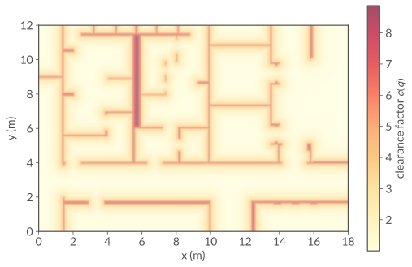

   The factor :math:`c(q)` over the corridor with :math:`\kappa = 1.5` and :math:`\beta = 3`.
   Warm colors near walls mark a large factor.

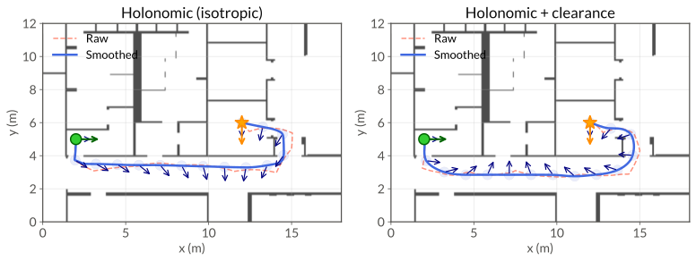

   The disc robot. Left, the plain metric, whose path cuts close to walls. Right, the
   clearance metric with :math:`\kappa = 1.5` and :math:`\beta = 3`, whose path keeps its
   distance from the walls.

The footprint checker's ``operator()`` returns the signed clearance of the footprint, and
the same object serves as the planner's validity check and the metric's distance field.

.. code-pair:: tutorials/se2_planning diff-clearance

.. video-figure:: se2-diff-clearance-sweep
   :width: 60%
   :alt: Animated differential-drive robot with clearance

   The differential-drive robot following the path under the clearance metric.

7. Park a car
-------------

The parking lot is a list of oriented rectangles (:cpp:class:`geodex::collision::RectObstacle`),
four parked cars along a curb with a gap between cars 2 and 3.

.. code-pair:: tutorials/se2_planning parking-lot

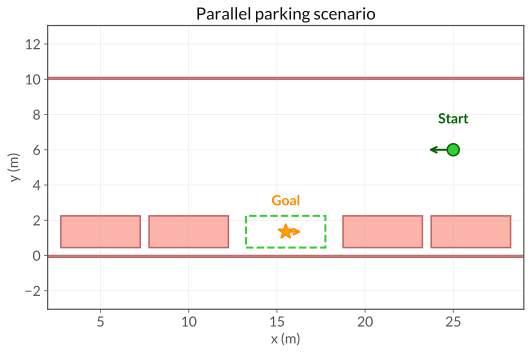

   The parking lot. The car starts on the right (green) and parks in the gap (orange star).

The car-like metric trades turning against driving at a turning radius of 1.5 m.

.. code-pair:: tutorials/se2_planning car-metric

:cpp:class:`geodex::collision::RectSmoothSDF` is a smooth signed distance to the rectangles,
a log-sum-exp approximation of the minimum. Its ``inflation`` subtracts the car's half width
from every distance.

.. code-pair:: tutorials/se2_planning rect-sdf

The validity check tests the car's rectangle against every obstacle with the
separating-axis test :cpp:func:`geodex::collision::rects_overlap`.

.. code-pair:: tutorials/se2_planning sat-validity

The clearance metric with :math:`\kappa = 8` keeps the car away from the parked cars. The
parking maneuver reverses into the gap, and the plan does not use a directional validator.

.. code-pair:: tutorials/se2_planning parking

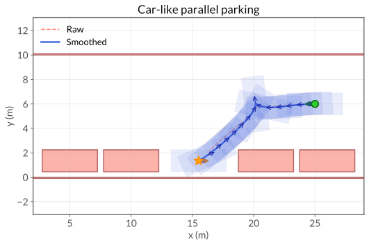

   The car approaches from the right and reverses into the gap between the parked cars.

.. video-figure:: se2-parking-footprints
   :width: 70%
   :alt: Animated parking footprint sweep

   The car's footprint along the parking path.

Near the start and the goal, the path can turn in place where a real car would need a
multi-point turn.

8. Try it: plan without the directional validator
-------------------------------------------------

Plan the differential-drive robot of step 5 again without ``motion_validator`` and measure
how far each path drives backward.

.. code-pair:: tutorials/se2_planning try-it

It prints ``backward driving: 0.147 m with the validator, 15.984 m without``. Without the
validator, the robot drives most of the corridor backward.

Where to go next
----------------

- :doc:`/robots/navigation` plans three Clearpath bases with these tools.
- :doc:`/concepts/metrics` covers the left-invariant and clearance metrics.
- :doc:`/concepts/smoothing` covers the smoother and what it checks.
- :doc:`geodex-basics` introduces manifolds, metrics and geodesics.
